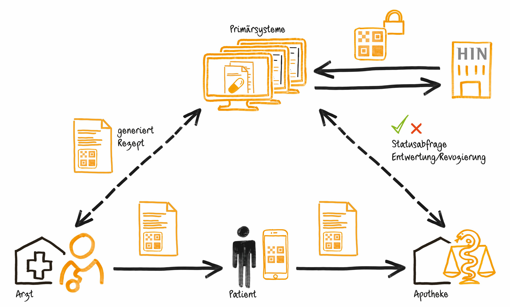
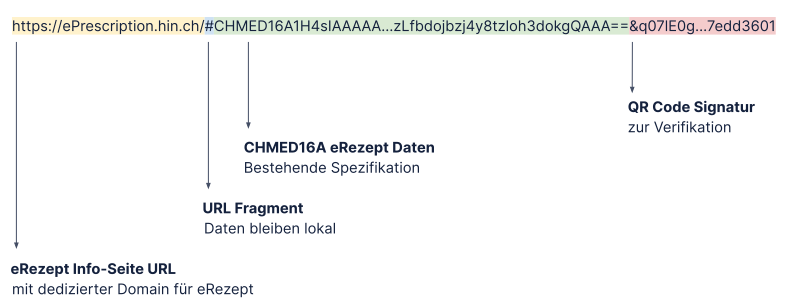

# Integration Guide: HIN Sign Rezept Signatur

## 1. HIN Sign Rezept Signatur

**Das sichere digitale Rezept für das Schweizer Gesundheitswesen**

Mit der HIN Sign Rezept Signatur können Ärztinnen und Ärzte digitale Rezepte ausstellen – einfach und gesetzeskonform. Apotheken können diese dank QR-Code automatisch erfassen und entwerten. Das macht die Abläufe in Praxis und Apotheke sicherer und effizienter. Die HIN Sign Rezept Signatur ist eine Funktion von HIN Sign. Die Nutzung des Services ist an eine HIN Mitgliedschaft gebunden.



**Anwendungsfälle**

Der HIN Sign Rezept Signatur Service umfasst folgende Anwendungsfälle für Ärzte und Apotheker:

* Signieren von eRezepten
* Verifizieren von eRezepten
* Revozieren von eRezepten
* (Teil-)Dispensieren von eRezepten
* Annullieren dieser Aktionen

### 1.2. Technische Anbindung durch Integration von HIN Sign

**eRezept als Teil von HIN Sign**

Die HIN Sign Rezept Signatur ist vollständig Teil des HIN Sign Service und wird deshalb über die gleiche Integration angebunden.
Die technische Anbindung erfolgt somit einmalig über die gleiche Komponente und die Integration kann wahlweise vollumfänglich oder nur teilweise genutzt werden.

Dies bedeutet für integrierende Parteien, dass

* eine - bestehende oder neue - HIN Sign Integration direkt auch für die eRezept Funktionen genutzt werden kann.
* eine - bestehende oder neue - HIN Sign Rezept Signatur Integration direkt auch für das Signieren von Dokumenten durch HIN Sign genutzt werden kann.

Zusätzlich zu den hier beschriebenen eRezept Funktionalitäten kommt HIN Sign bei allen Dokumenten zum Einsatz, bei denen eine Unterschrift üblich ist, aber das Gesetz keine handschriftliche Form vorschreibt. Beispiele:

* Rezepte und Verordnungen (Ausnahme: Betäubungsmittel-Rezept)
* Arbeitsunfähigkeitszeugnisse
* Berichte und Gutachten
* Klinische Befunde
* Formulare

## 2. HIN Sign Rezept Signatur QR Code Spezifikation

Der HIN Sign Rezept Signatur QR Code soll die Rezeptdaten in maschinenlesbarer Form sowie eine elektronische Signatur beinhalten. Um das Einlesen über die Smartphone Kamera zu ermöglichen wird es in Form eines Links gespeichert.

Der QR Code beinhaltet:

1. Einen Link zur Info-Seite
2. Die eRezept Daten im CHMED16A1 Format
3. Die Signatur Daten zur Verifizierung



Durch die Verwendung eines “URL Fragment” im Link wird die Vertraulichkeit der Lösung sichergestellt, sodass die Rezeptdaten ausschliesslich lokal verfügbar sind und keine Daten an einen Server geschickt werden.


### 2.1. Anweisungen zum Einlesen des signierten QR Code

Applikationen die den QR Code einlesen, können diesen direkt für die Verifikation der Signatur verwenden. Um danach die Rezeptdaten im CHMED16A1 Format auszulesen, sollten folgende Regeln beachtet werden:

* Ignorieren/Abtrennen der URL im Link
    * Alles vor dem # muss ignoriert werden um sicherzustellen, dass der Link jederzeit angepasst werden kann
* Ignorieren/Abtrennen der Signatur
    * Alles nach dem “&” muss ignoriert werden

### 2.2. QR Code Link

Um das Einlesen über die Smartphone Kamera zu ermöglichen wird es in Form eines Links gespeichert. Dazu wird eine neue separate Domäne registriert.

Beispiel:

```
https://eprescription.hin.ch/#CHMED16A1...AA==&q07lE0g4asrIIR9mdBgSIHUVsf9k9QIF+74331de34a747ea1a786dc369be50ac7bf222dde9788d8a170df8b6f593f1e8306eea7a79bcbfe9ae843308b1f860653886de77629cf1ae040537bfe817edd3601&i=Vorname%20Nachname%20%28HIN%20Id%29&t=1637579060&s=74331de34a747ea1a786dc369be50ac7bf222dde9788d8a170df8b6f593f1e8306eea7a79bcbfe9ae843308b1f860653886de77629cf1ae040537bfe817edd3601
```

### 2.3. QR Code Rezeptdaten

Die Rezeptdaten befinden sich im zweiten Teil hinter dem Fragment # und werden auf Basis bestehender [CHMED16A Spezifikation](https://drive.google.com/file/d/1sBUEHx86ya8TJUbNSbzJNcaWSLTHtONn/view) abgebildet.

Es soll aus Platzgründen nur die komprimierte Variante CHMED16A1 verwendet werden.

### 2.4. QR Code Signatur

Die QR Code Signatur soll es ermöglichen die Integrität und Authentizität des eRezepts zu gewährleisten und überprüfbar zu machen.

Aus Platzgründen wird dafür ein Schlüsselpaar verwendet.

Inhalt der Signatur:

* Identität des Akteurs (Name und HIN Id)
* Timestamp
* Kryptographische Signatur

Beispiel Signatur:

```
&i=Vorname%20Nachname%20%28HIN%20Id%29&t=1637579060&s=74331de34a747ea1a786dc369be50ac7bf222dde9788d8a170df8b6f593f1e8306eea7a79bcbfe9ae843308b1f860653886de77629cf1ae040537bfe817edd3601
```

Es ist mit einer Signatur im Umfang von ca. 250-300 Zeichen zu rechnen die im QR Code hinzugefügt werden müssen.

### 2.5. Schlüsselmanagement

Für die Signatur wird ein ECDSA Schlüssel verwendet der von HIN Sign auf einem gesicherten Server zugriffsgeschützt verwaltet wird.

Das System verfügt über die Möglichkeit zur Rotation resp. Erneuerung des Schlüssel. Damit kann der Schlüssel bei Bedarf jederzeit ersetzt werden.

Um sicherzustellen, dass ausgestellte eRezepte auch während und nach einer Rotation verifizierbar bleiben wird eine Liste aller Zertifikate der gültigen Schlüssel geführt.

### 2.6. Audit Log

Für jede Aktion wird bei HIN Sign in einem Audit Log ein entsprechender Eintrag geführt der folgende Informationen enthält:

* Art der Aktion (signieren, revozieren, entwerten, annullierung)
* Aktionsdaten
    * eRezept ID
    * Allfällige weitere Parameter der Aktion
* Aktor (Identität des Benutzers)
* Zeitpunkt der Aktion

Mit dem Audit Log soll sichergestellt werden, dass die Verwendung des Service nachvollziehbar ist. Das Audit Log kann auch verwendet werden um gewisse Missbräuche aufzudecken und diese anhand der Daten zu korrigieren.

Diese Korrekturen können per Massenmutation erfolgen, beschränken sich jedoch auf das ungültig erklären von fälschlicherweise ausgestellten Rezepten.

Zu beachten ist, dass im Audit Log keinerlei Daten aus dem eRezept, abgesehen von dessen ID, gespeichert werden.

### 2.7. Regeln

<table valign="top">
  <tr>
   <td><strong>Funktion</strong>
   </td>
   <td><strong>Regeln</strong>
   </td>
  </tr>
  <tr valign="top">
   <td>Erstellen
   </td>
   <td>CHMED16 eRezept ID darf nicht bereits ausgestellt worden sein<br>CHMED16 eRezept ID muss eine zufällige nach UUID Standard generierte ID sein
   </td>
  </tr>
  <tr valign="top">
   <td>Revozieren
   </td>
   <td>CHMED16 eRezept ID muss existieren
   </td>
  </tr>
  <tr valign="top">
   <td>Entwerten
   </td>
   <td>CHMED16 eRezept ID muss existieren<br>CHMED16 eRezept ID darf nicht revoziert sein<br>Falls die CHMED16 eRezept ID vollständig entwertet wurde, müssen weitere Entwertungen forciert werden (siehe <a href="https://github.com/certifaction/hinsign-cli#424-recording-an-eprescription-dispensation">4.2.4. Recording an ePrescription Dispensation</a>)
   </td>
  </tr>
  <tr valign="top">
   <td>Verifizieren
   </td>
   <td>n/a
   </td>
  </tr>
  <tr valign="top">
   <td>Annulieren
   </td>
   <td>Zu annulierender Event muss:<br>
        <ul>
          <li>existieren</li>
          <li>nicht bereits annuliert sein</li>
          <li>von selber HIN eID erstellt worden sein</li>
        </ul>
   </td>
  </tr>
</table>

### 2.8. Entwertung und Revokation

Um die Revokation und Abgabe von Medikamenten zu erfassen wird zu einem eRezept eine Liste von Events geführt die dessen Lebenszyklus abbilden.

#### 2.8.1. Events

##### Event Types
<table>
  <tr>
   <td>Revozierung
   </td>
   <td>Das eRezept wird für ungültig erklärt und ist nicht mehr gültig. Dies hat nichts mit Entwertungen zu tun und sollte nur bei fälschlicherweise ausgestellten eRezepten verwendet werden.
   </td>
  </tr>
  <tr>
   <td>Teil-Entwertung
   </td>
   <td>Für ein oder mehrere Medikamente im eRezept werden Teil-Abgaben erfasst. Das eRezept ist weiterhin für den Rest gültig. Teil-Entwertungen von revozierten Rezepten sind nicht erlaubt. Weitere Teil-Abgaben bei vollständig entwerteten Rezepten müssen forciert werden (siehe <a href="https://github.com/certifaction/hinsign-cli#424-recording-an-eprescription-dispensation">4.2.4. Recording an ePrescription Dispensation</a>). Bei forcierten Abgaben liegt die Verantwortung bei den Abgebenden.
   </td>
  </tr>
  <tr>
   <td>Vollständige Entwertung
   </td>
   <td>Das eRezept resp. sämtliche enthaltenen Medikamente werden als abgegeben markiert. Falls alle im Rezept enthaltenen Medikamente via Teil-Entwertung abgegen wurden, muss danach eine vollständige Entwertung gemacht werden (dies geschieht nicht automatisiert). Entwertungen von revozierten Rezepten sind nicht erlaubt. Weitere Abgaben bei vollständig entwerteten Rezepten müssen forciert werden (siehe <a href="https://github.com/certifaction/hinsign-cli#424-recording-an-eprescription-dispensation">4.2.4. Recording an ePrescription Dispensation</a>). Bei forcierten Abgaben liegt die Verantwortung bei den Abgebenden.
   </td>
  </tr>
  <tr>
   <td>Annullierung
   </td>
   <td>Ein Event (Revozierung, Teil-Entwertung, Vollständige Entwertung sowie eine andere Annullierung) werden als annulliert markiert.
   </td>
  </tr>
</table>

##### Event Data

Revokation und Entwertungen werden als Events erfasst und enthalten folgende Informationen:

<table>
  <tr>
   <td><strong>Name</strong>
   </td>
   <td><strong>Erforderlich?</strong>
   </td>
   <td><strong>Beschreibung</strong>
   </td>
  </tr>
  <tr>
   <td>Id
   </td>
   <td>mandatory
   </td>
   <td>Interne Id eines Events
   </td>
  </tr>
  <tr>
   <td>Type
   </td>
   <td>mandatory
   </td>
   <td>Type des Events
<p>
Es existieren folgende Typen:<p>
<p>
<code>revoke | partial_dispense | full_dispense | cancel</code><p>
   </td>
  </tr>
  <tr>
   <td>Reference
   </td>
   <td>mandatory
   </td>
   <td>Referenz auf das Feld “Id” des CHMED16 eRezept aus dem Input
   </td>
  </tr>
  <tr>
   <td>Event Data
   </td>
   <td>optional
   </td>
   <td>Für Type partial_dispense:
<p>
Eine Liste von Medikament Dispensationen mit folgenden Feldern:</p>
<table>
  <tr>
   <td><strong>Parameter</strong>
   </td>
   <td><strong>Value</strong>
   </td>
   <td><strong>Description</strong>
   </td>
  </tr>
  <tr>
   <td>Id
   </td>
   <td>string
   </td>
   <td>The Id of the Medication*
   </td>
  </tr>
  <tr>
   <td>Amount
   </td>
   <td>int
   </td>
   <td>Amount dispensed
   </td>
  </tr>
  <tr>
   <td>Substitute
   </td>
   <td>string
   </td>
   <td>The Id of the Substitute  \ Medication*
   </td>
  </tr>
</table><p>
*The Id is the field “Id” from the list of “Medications” from the CHMED16 data received as input. It does not regard the IdTypes and therefore works with all of them, assuming no collision between the different Types.</p>
<p>Für Type cancel:
<br>Eine Referenz auf eine ID eines anderen Events.</p>
<table>
  <tr>
   <td><strong>Parameter</strong>
   </td>
   <td><strong>Value</strong>
   </td>
   <td><strong>Description</strong>
   </td>
  </tr>
  <tr>
   <td>EventId
   </td>
   <td>string
   </td>
   <td>The Id of the event
   </td>
  </tr>
</table>
   </td>
  </tr>
  <tr>
   <td>Timestamp
   </td>
   <td>mandatory
   </td>
   <td>Zeitstempel
   </td>
  </tr>
  <tr>
   <td>Actor (HIN eID)
   </td>
   <td>mandatory
   </td>
   <td>HIN eID des Actors
   </td>
  </tr>
  <tr>
   <td>Actor (Name)
   </td>
   <td>mandatory
   </td>
   <td>Name des Actors
   </td>
  </tr>
</table>

Die Entwertungs-Liste wird in anonymisierter Form (dh. ohne die Inhalte aus dem eRezept und ohne Patienteninformationen) durch HIN in der Schweiz gehostet.

#### 2.8.2. Entwertung Szenarien

Durch die Möglichkeit zur Erfassung von abgegebenen Medikamenten und der Markierung eines Rezepts als “Vollständig Entwertet” werden die unten aufgeführten Anwendungsfälle ermöglicht. Dies sind Beispiele und decken nicht alle möglichen Anwendungsfälle ab.

Use Case 1: „Einfaches“ Rezept  
Use Case 2: „Einfaches“ Rezept mit Menge >1  
Use Case 3: Nicht repetierbares Rezept  
Use Case 4: Repetierbares Rezept  
Use Case 5: Repetierbares Rezept mit zeitlicher Beschränkung  
Use Case 6: Dauerrezept  
Use Case 7: Abgelaufenes Dauerrezept  
Use Case 8: Abgelaufenes „einfaches“ Rezept  
Use Case 9: Abgelaufenes repetierbares Rezept  
Use Case 10: Dauerrezept mit Substitution  
Use Case 11: Komplexes Rezept  

Im Appendix ist ein [Beispiel Anwendungsfall mit Entwertungen](#B-Beispiel-Anwendungsfall-mit-Entwertungen) detailliert beschrieben.


## 3. Integration des HIN Sign Rezept Signatur Service

### 3.1 Architektur

Ausstellersysteme (PIS/KIS) integrieren HIN Sign gemäss folgendem Schema über das CLI um die Daten ausschliesslich lokal zu verarbeiten:


### 3.2 Authentisierung und Autorisierung

Für die verschiedenen Funktionen des HIN Sign Rezept Signatur Service bestehen unterschiedliche Anforderungen betreffend der Stärke der Authentisierung und der erforderlichen Autorisierung.

**Übersicht**

<table valign="top">
  <tr>
   <td><strong>Funktion</strong>
   </td>
   <td><strong>Authentisierung</strong>
   </td>
   <td><strong>Tech</strong>
   </td>
   <td><strong>Autorisierung</strong>
   </td>
  </tr>
  <tr valign="top">
   <td>Erstellen
   </td>
   <td>Persönliche HIN eID mit Härtung 20 (Person Code 10)
   </td>
   <td>Via Auth-Service (basiert auf SAML)
   </td>
   <td>HIN Mitgliedschaft
   </td>
  </tr>
  <tr valign="top">
   <td>Revozieren
   </td>
   <td>Persönliche HIN eID mit Härtung 20
<p>
Team HIN eID
   </td>
   <td>Via Auth-Service (basiert auf SAML)
<p>
OAuth via HIN ACS
   </td>
   <td>HIN Mitgliedschaft
   </td>
  </tr>
  <tr >
   <td>Verifizieren
   </td>
   <td>Keine
   </td>
   <td>Keine
   </td>
   <td>
   </td>
  </tr>
  <tr valign="top">
   <td>Entwerten
   </td>
   <td>Persönliche & Team HIN eID
   </td>
   <td>OAuth via HIN ACS
   </td>
   <td>HIN Mitgliedschaft
   </td>
  </tr>
  <tr valign="top">
   <td>Annullieren
   </td>
   <td>Persönliche HIN eID mit Härtung 20
<p>
Team HIN eID
   </td>
   <td>Via Auth-Service (basiert auf SAML)
<p>
OAuth via HIN ACS
   </td>
   <td>HIN Mitgliedschaft
<p>
& Nur selber erstellte Events
   </td>
  </tr>
</table>

Hinweis zur Authentisierung mit “Persönliche HIN eID mit Härtung 20”:
Diese Authentisierung wird über den HIN / ADSwiss Auth-Service abgewickelt, welcher sicherstellt dass es sich beim Nutzer um einen korrekt identifizierte und zeitnah authentisierte Person handelt (wird nur auf Prod sichergestellt). HIN Sign stellt zudem über den Person Code sicher dass es sich um ein Arzt / Ärztin handelt.

**EPD Authentisierung**<br>
Die Ausstellung von eRezepten erfordert die Authentifizierung nach EPD-Level.
Dazu wird der HIN/ADSwiss Auth-Service gemäss folgendem Ablaufdiagramm verwendet:


## 4. HIN Sign API für Rezept Signatur

### 4.1. Introduction

This section is an addendum to the [Certifaction CLI](https://github.com/certifaction/cli) documentation in the context of creating, revoking, redeeming and verifying ePrescription QR codes.

Please refer to the main documentation for a general description of the Certifaction CLI.

#### 4.1.1. CLI Version

The ePrescription functionality is available from version v1.0.x and above.

The binary can be downloaded <a href="https://github.com/certifaction/hinsign-cli/releases" target="_blank">here</a>.

#### 4.1.2. How to activate the ePrescription functionality

To unlock the specific ePrescription commands and HTTP endpoints, you will need to define the following environment variables:
```
ENABLE_EPRESCRIPTION=true
```

#### 4.1.3. ePrescription JSON input
The Certifaction CLI command generates ePrescriptions signatures for ePrescriptions based on the CHMED16A1 standard as described under [Spezifikation QR Code](#2-eRezept-QR-Code-Spezifikation).

#### 4.1.4. General usage

The Certifaction CLI can be used either as a command line tool as follows, or as HTTP REST API in its server mode.

```
certifaction [certifaction flags] <command> [arguments]
```


Use certifaction help &lt;command> for more information about the command.

Please refer to the main documentation for the list of all available global flags and about the [CLI HTTP server mode](https://github.com/certifaction/cli#http-server-mode).

#### 4.1.5. Authentication

Please see chapter [Authentisierung und Autorisierung](#32-Authentisierung-und-Autorisierung)
When indicated, the requests must be authenticated using the Authorization header as following (an environment is provided for testing that does not enforce authentication):

HTTP Server Mode:
```
Authorization: Bearer <AccessToken>
```

CLI Mode:
```
--token
```

If the request is not authenticated a HTTP 401 Unauthorized or a HTTP 403 Forbidden response is returned.

For the creation of ePrescription the elevated EPD-Level Authentication based on SAML artifacts is mandatory. Please refer to the [respective section](#32-Authentisierung-und-Autorisierung) for further details.

### 4.2. ePrescription Endpoints

This section describes the additional endpoints available when the ePrescription mode is enabled.

Please refer to the main documentation for more information about the [CLI HTTP server mode](https://github.com/certifaction/cli#http-server-mode).

When the ePrescription mode is enabled, the following new endpoints are enabled:

<table>
  <tr>
   <td>POST /ePrescription/create
   </td>
   <td>Return a signed ePrescription QR code from the valid JSON document provided in the body.
   </td>
  </tr>
  <tr>
   <td>POST /ePrescription/verify
   </td>
   <td>Return verification information about a signed ePrescription QR code provided in the body.
   </td>
  </tr>
  <tr>
   <td>POST /ePrescription/revoke/&lt;id>
   </td>
   <td>Invalidate a signed ePrescription QR code by registering it as revoked.
   </td>
  </tr>
  <tr>
   <td>POST /ePrescription/dispense/&lt;id>
   </td>
   <td>Registers a full or partial dispensation for a signed ePrescription.
   </td>
  </tr>
  <tr>
   <td>POST /ePrescription/cancel/&lt;id>/&lt;eventid>
   </td>
   <td>Registers a cancelation of an event (revoke, dispense, cancel).
   </td>
  </tr>
</table>

The HTTP endpoints directly mirror the CLI commands.

#### 4.2.1. Creating an ePrescription QR Code

**Usage**
```
POST /ePrescription/create
```

**Description**<br>
Generate a signed ePrescription QR code from a valid input JSON document in the body.  The available output formats are the following:

* a QR Code image binary data in PNG format, or
* the signed QR Code data as string

**Authenticated**<br>
Yes

**Query parameters**

<table>
  <tr>
   <td><strong>Parameter</strong>
   </td>
   <td><strong>Value</strong>
   </td>
   <td><strong>Default</strong>
   </td>
   <td><strong>Description</strong>
   </td>
  </tr>
  <tr valign="top">
   <td>output-format
   </td>
   <td>data or qrcode
   </td>
   <td>qrcode
   </td>
   <td>Sets the output format:
<ul>
<li>qrcode: returns the signed QR Code as a PNG
<li>data: returns the signed qr code data as string in JSON
</li>
</ul>
   </td>
  </tr>
  <tr valign="top">
   <td>size
   </td>
   <td>Value in pixels
   </td>
   <td>
   </td>
   <td>Can be used with the --output-format qrcode to indicate the size of the resulting QR Code in pixels. Optional
   </td>
  </tr>
</table>


**Response**

<table>
  <tr>
   <td>200 OK
   </td>
   <td>Returns the requested signed QR code in the required format
   </td>
  </tr>
  <tr>
   <td>404 Bad Request
   </td>
   <td>The input JSON could not be parsed
   </td>
  </tr>
</table>

Depending on the value of the output-format query parameter:

<table>
  <tr>
   <td><strong>MIME type</strong>
   </td>
   <td><strong>Content</strong>
   </td>
  </tr>
  <tr>
   <td>image/png
   </td>
   <td>The signed ePrescription QR Code image as a PNG
   </td>
  </tr>
  <tr>
   <td>application/json
   </td>
   <td>The signed QR code data as string in JSON
   </td>
  </tr>
</table>

#### 4.2.2. Verifying an ePrescription QR Code

**Usage**
```
POST /ePrescription/verify
```

**Description**<br>
Returns verification information about a signed ePrescription QR code provided in the body.

**Authenticated**<br>
No

**Request Body**<br>
A signed ePrescription QR Code in its string form.

**Response**<br>
The verification information consists of the following information:

<table>
  <tr>
   <td>Valid
   </td>
   <td>True if the QR code is correctly signed and not tampered with
   </td>
  </tr>
  <tr>
   <td>Revoked
   </td>
   <td>True if the QR code has been marked as revoked
   </td>
  </tr>
  <tr>
   <td>Dispensed
   </td>
   <td>True if the QR code has been marked as fully dispensed
   </td>
  </tr>
  <tr valign="top">
   <td>Dispensations
   </td>
   <td>If available, an array containing each Medication with a recorded Dispensation event and a list of those events
   </td>
  </tr>
</table>


**Example Response**

```
{
   "prescription_id":"00000000-0000-0000-0000-000000000000",
   "issued_at":"0000-00-00T00:00:00+00:00",
   "issued_by":"Dr. Test Test 1 (test1)",
   "valid":true,
   "revoked":false,
   "dispensed":true,
   "dispensed_at":"0000-00-00T00:00:00.000000000Z",
   "dispensed_by":"HIN|pharma1",
   "events":[
      {
         "id":"00000000-0000-0000-0000-000000000000",
         "type":"full_dispense",
         "reference":"00000000-0000-0000-0000-000000000000",
         "timestamp":"0000-00-00T00:00:00.000000000Z",
         "actor":"pharma1",
	 "actor_name":"Pharmacist 1"
      }
   ]
}
```

#### 4.2.3. Revoking an ePrescription QR Code

**Usage**
```
POST /ePrescription/revoke/<id>
```

**Description**<br>
Invalidate a signed ePrescription QR code by registering it as revoked

**Authenticated**<br>
Yes

**Query parameters**<br>
<table>
  <tr>
   <td><strong>Parameter</strong>
   </td>
   <td><strong>Value</strong>
   </td>
   <td><strong>Description</strong>
   </td>
  </tr>
  <tr>
   <td>Id
   </td>
   <td>string
   </td>
   <td>The Id of the ePrescription to be revoked
   </td>
  </tr>
</table>


**Response**

<table>
  <tr>
   <td>200 OK
   </td>
   <td>The ePrescription has been successfully revoked
   </td>
  </tr>
</table>

#### 4.2.4. Recording an ePrescription Dispensation

**Usage**
```
POST /ePrescription/dispense/<id>
```

**Description**<br>
Registers a full or partial dispensation for a signed ePrescription. Dispensations on revoked ePrescriptions are not allowed. Dispensations on fully dispensed ePrescriptions need to be forced (see below)

**Authenticated**<br>
Yes

**Query parameters**

<table>
  <tr>
   <td><strong>Parameter</strong>
   </td>
   <td><strong>Value</strong>
   </td>
   <td><strong>Description</strong>
   </td>
  </tr>
  <tr>
   <td>Id
   </td>
   <td>string
   </td>
   <td>The Id of the ePrescription to be dispensed
   </td>
  </tr>
  <tr valign="top">
   <td>Body
   </td>
   <td>See below
   </td>
   <td>Optional list of Medication dispensation to record a partial dispensation
   </td>
  </tr>
  <tr valign="top">
   <td>force
   </td>
   <td>boolean
   </td>
   <td>Optional parameter to force a dispensation if the prescription was fully dispensed
   </td>
  </tr>
</table>


**Request Body**<br>
The request body optionally contains a list of Medication dispensation to record a partial dispensation.

The input consists of the following fields:

<table>
  <tr>
   <td><strong>Parameter</strong>
   </td>
   <td><strong>Value</strong>
   </td>
   <td><strong>Description</strong>
   </td>
  </tr>
  <tr>
   <td>Id
   </td>
   <td>string
   </td>
   <td>The Id of the Medication
   </td>
  </tr>
  <tr>
   <td>Amount
   </td>
   <td>int
   </td>
   <td>Amount dispensed
   </td>
  </tr>
</table>


**Example Request**

```
[
      {
         "Id":"2333266",
         "Amount":1,
      }
]
```

Please check the [section for Dispensation](#28-Entwertung-und-Revokation) for more information about what is stored.

**Response**

<table>
  <tr>
   <td>200 OK
   </td>
   <td>Successfully recorded dispensation event
   </td>
  </tr>
  <tr>
   <td>404 Bad Request
   </td>
   <td>Error while recording dispensation event
   </td>
  </tr>
  <tr>
   <td>403 Forbidden
   </td>
   <td>prescription has been revoked
   </td>
  </tr>
  <tr>
   <td>403 Forbidden
   </td>
   <td>prescription has been already fully dispensed
   </td>
  </tr>
</table>

#### 4.2.5. Canceling a previous action / event by its Id

**Usage**
```
POST /ePrescription/cancel/<id>/<eventId>
```

**Description**<br>
Registers a cancellation of a previously created event (revocation, dispensation, or other cancellation)

**Authenticated**<br>
Yes

**Query parameters**

<table>
  <tr>
   <td><strong>Parameter</strong>
   </td>
   <td><strong>Value</strong>
   </td>
   <td><strong>Description</strong>
   </td>
  </tr>
  <tr>
   <td>Id
   </td>
   <td>string
   </td>
   <td>The Id of the ePrescription
   </td>
  </tr>
  <tr>
   <td>EventId
   </td>
   <td>string
   </td>
   <td>The Id of the ePrescription’s event to be canceled
   </td>
  </tr>
</table>


**Request Body**<br>
none

**Response**

<table>
  <tr>
   <td>200 OK
   </td>
   <td>Successfully recorded cancellation event
   </td>
  </tr>
  <tr valign="top">
   <td>404 Bad Request
   </td>
   <td>Error while recording cancellation event if
<ul>
<li>Event is already canceled
<li>Event does not exist
<li>Event was issued by a different user
</li>
</ul>
   </td>
  </tr>
</table>

### 4.3. Example API Call

**Test data**<br>
Create a valid-chmed16a1.json file containing a valid CHMED16A1 data set.

**Command line**<br>
Here is the command to generate the signed ePrescription QR code:

```
ENABLE_EPRESCRIPTION=true ./certifaction ePrescription --api  https://oauth2.sign.hin.ch/api --token <access token> -o test-chmed16a1.pdf -f png test-ePrescription.png
```

**Server mode**<br>
First start the server using the following command:

```
ENABLE_EPRESCRIPTION=true ./certifaction server --api  https://oauth2.sign.hin.ch/api
```

Then post the ePrescription data to the /ePrescription/create endpoint as following to get the signed ePrescription QR code as response:

```
curl -X POST -H "Content-Type: application/json" -H "Authorization: Bearer <access token>" --data @valid-chmed16a1.json http://localhost:8082/ePrescription/create?type=qrcode > test-ePrescription.png
```

A complete example commands incl. authentication can be found in [Appendix A](#A-eRezept-Authentication-and-Use-case-Commands).

## Appendix

### A. eRezept Authentication and Use-case Commands

#### Test Environment

```
ENABLE_EPRESCRIPTION=true certifaction server --api https://api.testnet.certifaction.io --hin-api https://oauth2.sign-test.hin.ch/api
```

#### EPD Authentication

##### Required Secrets:
* A HIN Account
* A OAuth2 Client Id / Secret with permission for “ADSwiss_CI-Test”

##### OAuth Token for Auth Service
1. Get Access Code
    [http://apps.hin.ch/REST/v1/OAuth/GetAuthCode/ADSwiss_CI-Test?response_type=code&client_id=&lt;client_id>&redirect_uri=http%3A%2F%2Flocalhost%2FgetAccessToken](http://apps.hin.ch/REST/v1/OAuth/GetAuthCode/ADSwiss_CI-Test?response_type=code&client_id=<client_id>&redirect_uri=http%3A%2F%2Flocalhost%2FgetAccessToken)<br>
    or<br>
    Get OAuth2 auth code for “AD Swiss Convenience Interface Test” via [https://apps.hin.ch](https://apps.hin.ch)

2. Code to Token
	```
	curl -H "Content-Type: application/x-www-form-urlencoded" --data "grant_type=authorization_code&redirect_uri=http%3A%2F%2Flocalhost%2FgetAccessToken&code=<access_code>&client_id=<client_id>&client_secret=<client_secret>" https://oauth2.hin.ch/REST/v1/OAuth/GetAccessToken
	```

##### User Login

1. Get Login URL

    ```
    curl --request POST --url "https://oauth2.ci-prep.adswiss.hin.ch/authService/EPDAuth?targetUrl=http%3A%2F%2Flocalhost%2Fsuccess&style=redirect" --header "accept: application/json" --header "Authorization: Bearer <oauth_token_for_auth_service>"
    ```

2. Resolve Code to Handle

    ```
    curl --request POST --url "https://oauth2.ci-prep.adswiss.hin.ch/authService/EPDAuth/auth_handle" -d "{\"authCode\":\"<auth_code>\"}" --header "accept: application/json" --header "Content-Type: application/json" --header "Authorization: Bearer <oauth_token_for_auth_service>"
    ```


3. Use handle as token in `Authorization: Bearer <token>` header for calls to CLI


#### ACS Authentication

##### Required Secrets

* A HIN Account
* A OAuth2 Client Id / Secret with permission for “HINSign”

##### User Login

1. [http://apps.hin.ch/REST/v1/OAuth/GetAuthCode/HINSign?response_type=code&client_id=&lt;client_id>&redirect_uri=http%3A%2F%2Flocalhost%2FgetAccessToken](http://apps.hin.ch/REST/v1/OAuth/GetAuthCode/ADSwiss_CI-Test?response_type=code&client_id=<client_id>&redirect_uri=http%3A%2F%2Flocalhost%2FgetAccessToken)<br>
    or<br>
    Get OAuth2 auth code for “HIN Signaturservice” via [https://apps.hin.ch](https://apps.hin.ch) (HIN Login enforced)

2. Code to Token

    ```
    curl -H 'Content-Type: application/x-www-form-urlencoded' --data 'grant_type=authorization_code&redirect_uri=&code=<AUTHORIZATION CODE>&client_id=<client_id>&client_secret=<client_secret>' https://oauth2.hin.ch/REST/v1/OAuth/GetAccessToken
    ```

3. Use token in `Authorization: Bearer <token>` header for calls to CLI


#### Input Data

```
$ cat testCHMED16A1.txt
CHMED16A1H4sIAAAAAAAACr1WzW7bOBC+71MQvK6t8kd/9mnrdZINULdBkiZAFznQ9tgSJFMGRQVNs740r9Jn2NOe2hfboWQ5sZM0QRHENmVyNKLm++aHc02PlE1BW9q/pvvv1QJonw4Lo2iHvlsvD4wag0HBYIhqlPf8oMt5V0gUHYCe4r2+6NATawCcwgCMLq1RZQnE6XxKlyiVjDFc/Jnaq7WOe4We42IKOD1KCu3exqIeieMYB/5QvjdSae6U0ChvXpvyxxjScplC7k0S1DiclrT/9zU9vVpCbcmZcg9wT3qhxz0fh+AyjDzBOF68wIvlP6O3B6O9IWOcri46dARTR8DwXWlHoPFhZ5CBBe2zDj2e1Nsfooq/6jSTAMUoDXlw0YpEIwoifyPia1Ev2ohkOwlbdb65FzWmqLtweAun56j8qFNkWLgHdtGGweY+X12sVjWodIIu1LbZ0L2CCimlCMOatmYLiVCLRmNo902BoKlggnVZryvcpkN7WjSUHOpjKGtOhqjPPNbhONw/jgtnfWMAxkKG6qfZ/Lh0bJ4U07EBrZHaDn27XB66+ED5qRrnYC0QuLS5R1JNsiLJQZc/br7f/PiK4+b7V/z/VhmYGUhhQc5dWBmiqlm+o/RvCdoj+ILjQuHeRx/cFJY10yfV2NndEk05E3FYM9ay4P8qC3cYeIKFISwNlGVa7LAwKswcMZNKq3Gyi1zP0znBFCMjleRfILUIchvjPWxBEEoWv4SHn49tkFc2KSbJ1FST7M1fYL5sY/z4XGzkQXAd+n58pCbZnfzBghKIKJAviZM/ifNQzyCz91z4bHgPhKdsUfINNNHze1EsX9eFR8pkqS4LTd4Q3MHmGKs5zLeBnhUGIS3IySTJ1Qx051ejtobOH8rMoMdi8VL1qR38p9BHVZlBfgmmXCqtKzyUthNUfU4XKieSfCZ2F+o8TycJgRSrW7J4JDn5bfyKDdJYxswPXsrH7fi5j88Qoi2Ws3sQB5CSAUyVmXmEB6RLJCOjVFfoOHK59vkeVl5M0JYNTs4x4YEojIZdVv6bZI9SslOTb6m5DQIR8JD1wtdNbVe0THJlk0VV7vg/tXcJkA1wTXKl54R3WRdHh0yVVhgJ5zBJSsjdCVXfw++DoS/ux76PWe/77HVhP3Y2c7I5nTk6uMI+bzsSbh38BLwLBLGP3VrdprkFFg9YOH3UxiZlA7UpAMJ1igwhukuEn2bWyqPIj5yleN6gdhQyjk2cDIWs6+Wn0tleE9NQxV2rysQpD/tS9GX8O+P9uhE9XmDI0UHqALpKte6DsQdReQ7ENU9Z3TyBdkCVA0rmlSVgst3W4xsS6JyMrdjAdbd09dv/UKW0QFkLAAA=
```

#### Use Cases

1. Create a signed ePrescription

	Option 1: Output as Data/URL

	```
	$ curl -X POST -H "Content-Type: application/json" --data @testCHMED16A1.txt -H "authorization: Bearer <epd_token>" http://localhost:8082/ePrescription/create?output-format=data

	HTTP/200 OK
		{"SignedPrescriptionData":"https://eprescription.hin.ch/#CHMED16A1H4sIAA…lXGtoKAAA&i=Dr.+Test+Test&t=1642529665&s=70cd59558926868ca5dbf18e671eb44caffa6d0be491cf736ed39159ba25c4413177c83088a5f29bf7d5b6d78dc8daa4ab609d0a384dbc2834e00dbea4487db101"}
	```

	Option 2:  Output as PNG QR Code
	```
	$ curl -X POST -H "Content-Type: application/json" --data @testCHMED16A1.txt -H “authorization: Bearer &lt;epd_token>” http://localhost:8082/ePrescription/create?output-format=qrcode > testQrCode.png

	HTTP/200 OK
	```

2. Verify ePrescription

```
$ curl -X POST -H "Content-Type: application/json" -d 'https://eprescription.hin.ch/#CHMED16A1H4sIAA…lXGtoKAAA&i=Dr.+Test+Test&t=1642529665&s=70cd59558926868ca5dbf18e671eb44caffa6d0be491cf736ed39159ba25c4413177c83088a5f29bf7d5b6d78dc8daa4ab609d0a384dbc2834e00dbea4487db101' http://localhost:8082/ePrescription/verify

HTTP/200 OK
{
  "prescriptionId":"00000000-0000-0000-0000-000000000000",
  "issued_at":"0000-00-00T00:00:00+00:00",
  "issued_by":"Dr. Test Test 1 (Test1)",
  "valid":true,
  "revoked":false,
  "dispensed":false
}
```

3. Revoke ePrescription

```
$ curl -X POST -H "Content-Type: application/json" -H "authorization: Bearer <epd_token>" http://localhost:8082/ePrescription/revoke/00000000-0000-0000-0000-000000000000

HTTP/200 OK
```


4. Dispense ePrescription fully

```
$ curl -X POST -H "Content-Type: application/json" -H "authorization: Bearer <hin_acs_oauth_token>" http://localhost:8082/ePrescription/dispense/00000000-0000-0000-0000-000000000000

HTTP/200 OK
```


5. Verify ePrescription

```
$ curl -X POST -H "Content-Type: application/json" -d 'https://eprescription.hin.ch/#CHMED16A1H4sIAA…lXGtoKAAA&i=Dr.+Test+Test&t=1642529665&s=70cd59558926868ca5dbf18e671eb44caffa6d0be491cf736ed39159ba25c4413177c83088a5f29bf7d5b6d78dc8daa4ab609d0a384dbc2834e00dbea4487db101' http://localhost:8082/ePrescription/verify
HTTP/200 OK
{
  "prescriptionId":"00000000-0000-0000-0000-000000000000",
  "issued_at":"0000-00-00T00:00:00+00:00",
  "issued_by":"Dr. Test Test 1 (Test1)",
  "valid":true,
  "revoked":true,
  "revoked_at":"0000-00-00T00:00:00.000000000Z",
  "revoked_by":"HIN|test1",
  "dispensed":false,
  "events":[
    {
      "id":"00000000-0000-0000-0000-000000000000",
      "type":"revoke",
      "reference":"00000000-0000-0000-0000-000000000000",
      "event_data":{},
      "timestamp":"0000-00-00T00:00:00.000000000Z",
      "actor":"test1",
      "actor_name":"Dr. Test Test 1"
    }
  ]
}
```

### B. Beispiel Anwendungsfall mit Entwertungen

Im Folgenden wird anhand eines konkreten Use Cases aufgezeigt welche Informationen erfasst werden und wie eine Apotheke diese interpretieren kann um über eine Abgabe zu entscheiden.

Rezept:

* 1 Medikament mit Menge: 1
* Keine Angabe von Repetitionen, d. h. 1 x repetierbar (grundsätzlich nur falls Indikation noch gegeben ist)
* Kein Dauerrezept
* Ausstelldatum: 27.01.2022 → Gültigkeitsdauer abhängig von kantonalen Bestimmungen

<table>
  <tr>
   <td><strong>Wer</strong>
   </td>
   <td><strong>Ereignis</strong>
   </td>
   <td><strong>Erfasste Entwertungen</strong>
   </td>
  </tr>
  <tr>
   <td>Patient
   </td>
   <td>Erhält neues eRezept
   </td>
   <td>
   </td>
  </tr>
  <tr>
   <td>Patient
   </td>
   <td>Geht in Apotheke 1
   </td>
   <td>
   </td>
  </tr>
  <tr valign="top">
   <td>Apotheke 1
   </td>
   <td>Verifiziert eRezept und erkennt das noch keine Entwertungen erfolgt sind -> gibt Medikament aus gemäss Rezept
   </td>
   <td>
   </td>
  </tr>
  <tr valign="top">
   <td>Apotheke 1
   </td>
   <td>Erfasst Teil-Entwertung
   </td>
   <td>Teil-Entwertung:
<table>
  <tr>
   <td><strong>Event</strong>
   </td>
   <td><strong>Teil-Entwertung</strong>
   </td>
  </tr>
  <tr>
   <td>Anzahl
   </td>
   <td>1
   </td>
  </tr>
  <tr>
   <td>Datum
   </td>
   <td>28.01.2022
   </td>
  </tr>
  <tr valign="top">
   <td>Abgegeben von
   </td>
   <td>Apotheke 1
   </td>
  </tr>
  <tr valign="top">
   <td>Medikament
   </td>
   <td>3458478 (AMLODIPIN Sandoz eco Tabl 10 mg /
<p>
Blister 30 Stk)
   </td>
  </tr>
</table>
   </td>
  </tr>
  <tr>
   <td>Patient
   </td>
   <td>Geht in Apotheke 2
   </td>
   <td>
   </td>
  </tr>
  <tr valign="top">
   <td>Apotheke 2
   </td>
   <td>Verifiziert eRezept und erkennt das bereits eine Entwertungen erfolgt ist ->  gibt Medikament aus gemäss Rezept
   </td>
   <td>
   </td>
  </tr>
  <tr valign="top">
   <td>Apotheke 2
   </td>
   <td>Erfasst Teil-Entwertung und (optional) markiert Rezept als “vollständig” abgegeben
   </td>
   <td>Teil-Entwertung:
<table>
  <tr>
   <td><strong>Event</strong>
   </td>
   <td><strong>Teil-Entwertung</strong>
   </td>
  </tr>
  <tr>
   <td>Anzahl
   </td>
   <td>1
   </td>
  </tr>
  <tr>
   <td>Datum
   </td>
   <td>10.02.2022
   </td>
  </tr>
  <tr>
   <td>Abgegeben von
   </td>
   <td>Apotheke 2
   </td>
  </tr>
  <tr>
   <td>Medikament
   </td>
   <td>3458478 (AMLODIPIN Sandoz eco Tabl 10 mg /
<p>
Blister 30 Stk)
   </td>
  </tr>
</table>
Vollständige Entwertung:
<table>
  <tr>
   <td><strong>Event</strong>
   </td>
   <td><strong>Vollständige Entwertung</strong>
   </td>
  </tr>
  <tr>
   <td>Timestamp
   </td>
   <td>10.02.2022
   </td>
  </tr>
  <tr>
   <td>Actor
   </td>
   <td>Apotheke 2
   </td>
  </tr>
</table>
   </td>
  </tr>
  <tr>
   <td>Patient
   </td>
   <td>Geht in Apotheke 3
   </td>
   <td>
   </td>
  </tr>
  <tr valign="top">
   <td>Apotheke 3
   </td>
   <td>Verifiziert eRezept und erkennt das es bereits vollständig entwertet wurde -> gibt kein Medikament aus
   </td>
   <td>
   </td>
  </tr>
</table>


Analog zu diesem Beispiel können für sämtliche oben aufgeführten Use Cases die Medikamentenabgaben als Entwertungen erfasst werden um den Apotheken die Informationen zu liefern die Sie brauchen um über eine weitere Abgabe zu entscheiden.

### C. Beispiele Input- und Outputdaten

#### Beispiel “Einfach” (~660 characters)

CHMED16 Daten

```
CHMED16A1H4sIAAAAAAAEAMVU3W7TMBR+lcq3S4SPHdtx7raVAaKFqutAAnoREreJ2jpT4gKj6ptxx4txnCwVSKQSu0GVqvPX7+fIpwdyuXcFSYiSFCjloGKtNQnI2GGRUZAh1SGwBUASyYTqC8oSSnHgVe4HZM7z1UqF6WcqwkhxjCKdhcJkWc650GIlcXZq8sXDvSEJtHGZpTtjXUOSj4cORyuIpWpRu0EekFnVDYzxmwbtZ+l13dTV7g9t5Ij1eZVicfYWMRab9byxmF1urMH8zpbezO3iNTkGj4RRJIHH7Bwj/J2RhUAHGa+2e/fF1PnPH9bu7XqAnHEhZHzGrqeGJ5EXVVbk9T7bfHr20tTfBwRAxCQHen7f/y7guqi2pnGmLm1j7MbUA/Qx1VLz8/aftvvf7L9Pm2ZQAQgBTEX/QwL+dJa6Et8/SQ7kqr0z0DGEFPxbDsh16R48lqktZjdv8FYwnabfyl2KhRfG5giasIBMTj3nWp4JPrmEjJ93J+fxx5PGTY3X1tbSzuHpGDthCPUu3eKM4O2Kujbr29C3QcSd9ex0udibYyKUWvbLZX3Au54EdupFfSD6QD4CCBEIBcsjjpJZUVnv6yJCxlEsYMRk+59z62pj/MLuLBreoe2vZj2KsfOhvMcyp0yhAzLfbbzj4y8tzloh3gQAAA==
```


QR Code Inhalt

```
https://eprescription.hin.ch/#CHMED16A1H4sIAAAAAAAEAMVU3W7TMBR+lcq3S4SPHdtx7raVAaKFqutAAnoREreJ2jpT4gKj6ptxx4txnCwVSKQSu0GVqvPX7+fIpwdyuXcFSYiSFCjloGKtNQnI2GGRUZAh1SGwBUASyYTqC8oSSnHgVe4HZM7z1UqF6WcqwkhxjCKdhcJkWc650GIlcXZq8sXDvSEJtHGZpTtjXUOSj4cORyuIpWpRu0EekFnVDYzxmwbtZ+l13dTV7g9t5Ij1eZVicfYWMRab9byxmF1urMH8zpbezO3iNTkGj4RRJIHH7Bwj/J2RhUAHGa+2e/fF1PnPH9bu7XqAnHEhZHzGrqeGJ5EXVVbk9T7bfHr20tTfBwRAxCQHen7f/y7guqi2pnGmLm1j7MbUA/Qx1VLz8/aftvvf7L9Pm2ZQAQgBTEX/QwL+dJa6Et8/SQ7kqr0z0DGEFPxbDsh16R48lqktZjdv8FYwnabfyl2KhRfG5giasIBMTj3nWp4JPrmEjJ93J+fxx5PGTY3X1tbSzuHpGDthCPUu3eKM4O2Kujbr29C3QcSd9ex0udibYyKUWvbLZX3Au54EdupFfSD6QD4CCBEIBcsjjpJZUVnv6yJCxlEsYMRk+59z62pj/MLuLBreoe2vZj2KsfOhvMcyp0yhAzLfbbzj4y8tzloh3gQAAA==&i=Vorname+Nachname+%28HIN+Id%29&t=1637579060&s=74331de34a747ea1a786dc369be50ac7bf222dde9788d8a170df8b6f593f1e8306eea7a79bcbfe9ae843308b1f860653886de77629cf1ae040537bfe817edd3601
```

QR Code


#### Beispiel “Dora Graber” (~1350 characters)

CHMED16 Daten

```
CHMED16A1H4sIAAAAAAAACr2WX2/iOBDAv4rl1wtZ/yEh8LTlaHuVll1Eu620qz4YGIiV4CDHqbbb49v0M9zTvfHFbhwaWvpvV6eqgIMzGTv+zYzHc0NHymkwjvZu6NFntQTao4PCKhrQT3e3x1ZNwKKgP0A1yrvtqMV5S0gUHYOZ4bOeCOipswBeoQ/WlM6qsgTidb7pFUolYwxv/tTu+k7Hv8Is8GYG2B2lhfFvY50uSZIEG/5QfjhUOvdKuKhwUS/l4wR0udKQh9MUNU5mJe19v6Fn1yuoV3Ku/AAeyjAOedjGJriMO6FgHC9hFCby7+HB8fBwwBin68uADmHmDTD4VLohGBzsF2RhSXssoONpPf0JqrTXwbYToRilMY8uG5HYiqJOeyfid6JuZyeSTSdu1PnuWWe7FPUQhzc4XW/Kr0ajhYUf8Jg2jnbP+fpyva6h9BRdaNx2Qv8KKqSUIo5rs22nkIhabDUG7sgWCE0FE6zFui3hJx24s2JrkhMzhrK2yQD1WcgCjs3/Y7v0q98uAGMhQ/WzbDEuvTVPi9nEgjFo2oAerFYnPj5QfqYmOTgHBK5cHhJtSFakOZhyc1tZmFvQsCQXPpAsUdU83/xTggkJTjIuFI4fffFdWNXWPK0mfm2NMSlnIolrqzSk7f9L+oDyF6QDWFkoS108Ih0WdoFcpDJqkm5uzUIvCG4cMlRp/hO0Q6x9qic0URRLlryF336fpp9XLi2m6cxW0+zDX2B/7lN9fZmGPIsT0M+TkZpmD/YBJoZIdCL5lmT8l2QnZg6Ze+KmV4CeCTrZcPEdjOi2u51Evq+bRspm2pSFIR8IzuByjMAcFvto54VFpCU5naa5moMJfj8Wa1j+3A6LuiwRb5VLmsZfhR1WZQb5FdhypYyp8ADZ32jqh16qnEjyg7jN7SLX05SAxtyTLl/YZPw+KsWOLZEJa0dv5cemve7Hc4RyxWr+BKoPmvRhpuw8JDwiLSIZGWpToavI1Z1fDzFL4rZr+Dm5wI0LRKHH3ebfafaiER7lz3tj3DtaRDxm3fh9t6hPNza9dumyKh/5WLuHyHKLakiuzILwFmthC8hMGYW+v4BpWkLuz4/6GX6fDW/xNL7buJfbbfa+2C+dlZzsTkuOLq2w7tr3/b2D6et4+OrREVZPddnkbzAlwNLrozYWDTvU2ghYttWf1jOX5oPjDvCkQO1OzDgWVTIWss6C30q/duzUpSOaivvSkYkzHvek6MnkD8Z79QTjJYYc7WsP6LPRXV2KNYHKcyC+mMnqYgaMB1UelCwqR8Bm+eYWTebdisVQ39eXdP0fL5lXGtoKAAA=
```

QR Code Inhalt

```
https://eprescription.hin.ch/#CHMED16A1H4sIAAAAAAAACr2WX2/iOBDAv4rl1wtZ/yEh8LTlaHuVll1Eu620qz4YGIiV4CDHqbbb49v0M9zTvfHFbhwaWvpvV6eqgIMzGTv+zYzHc0NHymkwjvZu6NFntQTao4PCKhrQT3e3x1ZNwKKgP0A1yrvtqMV5S0gUHYOZ4bOeCOipswBeoQ/WlM6qsgTidb7pFUolYwxv/tTu+k7Hv8Is8GYG2B2lhfFvY50uSZIEG/5QfjhUOvdKuKhwUS/l4wR0udKQh9MUNU5mJe19v6Fn1yuoV3Ku/AAeyjAOedjGJriMO6FgHC9hFCby7+HB8fBwwBin68uADmHmDTD4VLohGBzsF2RhSXssoONpPf0JqrTXwbYToRilMY8uG5HYiqJOeyfid6JuZyeSTSdu1PnuWWe7FPUQhzc4XW/Kr0ajhYUf8Jg2jnbP+fpyva6h9BRdaNx2Qv8KKqSUIo5rs22nkIhabDUG7sgWCE0FE6zFui3hJx24s2JrkhMzhrK2yQD1WcgCjs3/Y7v0q98uAGMhQ/WzbDEuvTVPi9nEgjFo2oAerFYnPj5QfqYmOTgHBK5cHhJtSFakOZhyc1tZmFvQsCQXPpAsUdU83/xTggkJTjIuFI4fffFdWNXWPK0mfm2NMSlnIolrqzSk7f9L+oDyF6QDWFkoS108Ih0WdoFcpDJqkm5uzUIvCG4cMlRp/hO0Q6x9qic0URRLlryF336fpp9XLi2m6cxW0+zDX2B/7lN9fZmGPIsT0M+TkZpmD/YBJoZIdCL5lmT8l2QnZg6Ze+KmV4CeCTrZcPEdjOi2u51Evq+bRspm2pSFIR8IzuByjMAcFvto54VFpCU5naa5moMJfj8Wa1j+3A6LuiwRb5VLmsZfhR1WZQb5FdhypYyp8ADZ32jqh16qnEjyg7jN7SLX05SAxtyTLl/YZPw+KsWOLZEJa0dv5cemve7Hc4RyxWr+BKoPmvRhpuw8JDwiLSIZGWpToavI1Z1fDzFL4rZr+Dm5wI0LRKHH3ebfafaiER7lz3tj3DtaRDxm3fh9t6hPNza9dumyKh/5WLuHyHKLakiuzILwFmthC8hMGYW+v4BpWkLuz4/6GX6fDW/xNL7buJfbbfa+2C+dlZzsTkuOLq2w7tr3/b2D6et4+OrREVZPddnkbzAlwNLrozYWDTvU2ghYttWf1jOX5oPjDvCkQO1OzDgWVTIWss6C30q/duzUpSOaivvSkYkzHvek6MnkD8Z79QTjJYYc7WsP6LPRXV2KNYHKcyC+mMnqYgaMB1UelCwqR8Bm+eYWTebdisVQ39eXdP0fL5lXGtoKAAA=&i=Vorname+Nachname+%28HIN+Id%29&t=1637579060&s=74331de34a747ea1a786dc369be50ac7bf222dde9788d8a170df8b6f593f1e8306eea7a79bcbfe9ae843308b1f860653886de77629cf1ae040537bfe817edd3601
```

QR Code


