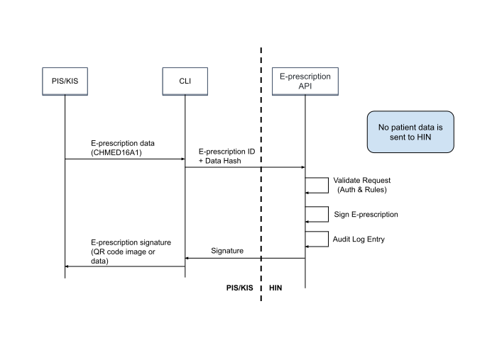

# Integration guide: E-Prescription Switzerland service

## 1. E-Prescription Switzerland service

**The secure digital E-Prescription for the Swiss healthcare sector**

The E-Prescription Switzerland service enables doctors to issue digital prescriptions – easily and in accordance with the law. The QR code enables pharmacies to record and validate them automatically. This means that processes in doctor's practices and pharmacies are more secure and more efficient. The E-Prescription Switzerland service is a functionality of HIN Sign. The use of this service is linked to HIN membership.


**Use cases**

The E-Prescription Switzerland service includes the following use cases for doctors and pharmacists:

* Signing E-Prescriptions
* Verifying E-Prescriptions
* Revoking E-Prescriptions
* (Partial) dispensing of E-Prescriptions
* Cancelling these actions

### 1.2. Integration of the E-Prescription Switzerland service

**E-Prescription as part of HIN Sign**

The E-Prescription Switzerland service is part of the HIN Sign service and is therefore available via the same integration. The component only needs to be integrated once and can be used to sign documents and/or E-Prescriptions.

For integrators, this means:

* An existing or new "HIN Sign document signature"-integration can also make use of the E-Prescription functionality.
* An existing or new "E-Prescription Switzerland service"-integration can also be used to sign documents.

The HIN Sign document signature can be used to sign documents, which don't require a handwritten signature by law. Examples:

* Medical prescriptions (exception: narcotic prescriptions)
* Certificates of incapacity for work
* Reports and expert opinions
* Clinical findings
* Forms

## 2. E-Prescription Switzerland service: QR code specification

The E-Prescription Switzerland service QR code contains the E-Prescription data in machine-readable form, as well as an electronic signature.

The QR Code contains:

1. A link to the E-Prescription information page
2. The E-Prescription data in CHMED16A1 format
3. The signature data for verification


The use of a “URL fragment” in the link ensures that the E-Prescription data is only available locally and is not sent to a server.


### 2.1. E-Prescription data in the QR code

Applications that want to verify the E-Prescription can do so by using the link in the QR code as the input for the [verify command](#422-verifying-an-E-Prescription-qr-code). Example:
```
https://eprescription.hin.ch/#CHMED16A1...AA==&q07lE0g4asrIIR9mdBgSIHUVsf9k9QIF+74331de34a747ea1a786dc369be50ac7bf222dde9788d8a170df8b6f593f1e8306eea7a79bcbfe9ae843308b1f860653886de77629cf1ae040537bfe817edd3601&i=FirstName%20Surname%20%28HIN%20Id%29&t=1637579060&s=74331de34a747ea1a786dc369be50ac7bf222dde9788d8a170df8b6f593f1e8306eea7a79bcbfe9ae843308b1f860653886de77629cf1ae040537bfe817edd3601
```

The E-Prescription data is located in the link in the QR code between the "#" and the "&". It is based on the <a href="https://drive.google.com/file/d/1Suyfb4I5WuII-XBqGuHLPocUIQ5mkTjA/view" target="_blank">CHMED16A specification</a>. Because the link should be as short as possible, only the compressed variant CHMED16A1 should be used.

### 2.2. QR code signature

The QR code signature ensures the integrity and authenticity of the E-Prescription and enables it to be verified. A key pair is used to save space. The signature is about 250 to 300 characters in length.

The signature contains:

* Identity of the actor (Name and HIN eID)
* Timestamp
* Cryptographic signature

Example:
```
&i=Firstname%Lastname%20%28HIN%20eID%29&t=1637579060&s=74331de34a747ea1a786dc369be50ac7bf222dde9788d8a170df8b6f593f1e8306eea7a79bcbfe9ae843308b1f860653886de77629cf1ae040537bfe817edd3601
```

### 2.3. Key management

An ECDSA key is used for the signature. It is stored and managed on a secure access-controlled server. The key can be rotated or renewed if necessary. To ensure that past E-Prescriptions remain valid during and after a rotation, a list of all valid keys is kept.

### 2.4. Audit log

Every action triggers an entry in a HIN Sign audit log. It contains the following information:

* Type of action (signature, revocation, dispensation, cancellation)
* Action data
	* E-Prescription ID
	* Any other action parameters
* Actor (user identity)
* Timestamp of action

The audit log should ensure that the use of the service is transparent. The audit log can also be used to identify and correct any misuse. The corrections can be done in bulk. However, they are limited to the revoking of wrongly issued E-Prescriptions.

The audit log does not contain any E-Prescription data, with the exception of its ID.

### 2.5. Rules

| Action   | Rules                                                                                                                                                                                                                                                                                                      |
|:---------|:-----------------------------------------------------------------------------------------------------------------------------------------------------------------------------------------------------------------------------------------------------------------------------------------------------------|
| Create   | - CHMED16A E-Prescription ID must be a randomly generated ID, according to the UUID standard<br>- CHMED16A E-Prescription ID must be unique and not issued yet                                                                                                                                             |
| Revoke   | - CHMED16A E-Prescription ID must exist<br>- Revocation is final. Revoked E-Prescriptions can only be verified.                                                                                                                                                                                            |
| Dispense | - CHMED16A E-Prescription ID must exist<br>- CHMED16A E-Prescription ID must not have been revoked<br>- If the CHMED16A E-Prescription ID was fully dispensed, further dispensations must be forced (see [4.2.4. Recording an E-Prescription Dispensation](#424-recording-an-E-Prescription-dispensation)) |
| Verify   | n/a                                                                                                                                                                                                                                                                                                        |
| Cancel   | The event to be cancelled must:<br>- exist<br>- have been created by the same HIN eID<br>- not have been cancelled already                                                                                                                                                                                 |
| Lock     | CHMED16A E-Prescription must exist and must not be locked or revoked.                                                                                                                                                                                                                              |
| Unlock   | CHMED16A E-Prescription must exist, must be locked and must not be revoked.                                                                                                                                                                                                                                        |


### 2.6. Events

Events record the lifecycle of an E-Prescription. 

#### 2.6.1. Event types

<table>
  <tr>
   <td>Revoke
   </td>
   <td>The E-Prescription is marked as void and is not valid anymore. This has nothing to do with dispensations and should only be used for wrongly issued E-Prescriptions.
   </td>
  </tr>
  <tr>
   <td>Partial dispense
   </td>
   <td>One or multiple prescribed medicaments are dispensed. The E-Prescription still contains medicaments that were not dispensed. Partial dispenses of revoked E-Prescriptions are not allowed. Partial dispenses of fully dispensed E-Prescriptions must be forced (see <a href="https://github.com/certifaction/hinsign-cli#424-recording-an-E-Prescription-dispensation">4.2.4. Recording an E-Prescription Dispensation</a>). In the case of forced dispensations, the responsibility lies with the dispensers (pharmacists).
   </td>
  </tr>
  <tr>
   <td>Full dispense
   </td>
   <td>The E-Prescription or all medicaments contained in it are  dispensed. If all medicaments contained in the E-Prescription have been dispensed through partial dispense, a full dispense must be made afterwards (this is not done automatically). Dispenses of revoked E-Prescriptions are not allowed. Full dispenses of fully dispensed E-Prescriptions must be forced (see <a href="https://github.com/certifaction/hinsign-cli#424-recording-an-E-Prescription-dispensation">4.2.4. Recording an E-Prescription Dispensation</a>). In the case of forced dispensations, the responsibility lies with the dispensers (pharmacists).
   </td>
  </tr>
  <tr>
   <td>Cancel
   </td>
   <td>An event (Revoke, Partial dispense, Full dispense, Cancel) is cancelled.
   </td>
  </tr>
  <tr>
    <td>Lock</td>
    <td>The E-Prescription is locked. The lock reason is included in the lock event, if a reason was provided.</td>
  </tr>
  <tr>
    <td>Unlock</td>
    <td>The E-Prescription is unlocked. The unlock reason is included in the unlock event, if a reason was provided.</td>
  </tr>
</table>

#### 2.6.2. Event data

Revocations, (partial) dispensations and cancellations contain the following data:

<table>
  <tr>
   <td><strong>Field name</strong>
   </td>
   <td><strong>Mandatory?</strong>
   </td>
   <td><strong>Description</strong>
   </td>
  </tr>
  <tr>
   <td>Id
   </td>
   <td>mandatory
   </td>
   <td>Internal Id of an event
   </td>
  </tr>
  <tr>
   <td>Type
   </td>
   <td>mandatory
   </td>
   <td>Event type
<p>
The following event types exist:<p>
<p>
<code>revoke | partial_dispense | full_dispense | cancel | lock | unlock</code><p>
   </td>
  </tr>
  <tr>
   <td>Reference
   </td>
   <td>mandatory
   </td>
   <td>Reference to the "Id" field of the CHMED16A E-Prescription
   </td>
  </tr>
	
  <tr>
   <td>Dispenses
   </td>
   <td>optional
   </td>
   <td>For <code>partial_dispense</code>:
<p>
A list of medicament dispenses with the following fields:
</p>
<table>
  <tr>
   <td><strong>Parameter</strong>
   </td>
   <td><strong>Value</strong>
   </td>
   <td><strong>Description</strong>
   </td>
  </tr>
  <tr>
   <td>Id
   </td>
   <td>string
   </td>
   <td>The Id of the medicament*
   </td>
  </tr>
  <tr>
   <td>Amount
   </td>
   <td>int
   </td>
   <td>Amount dispensed
   </td>
  </tr>
  <tr>
   <td>Substitute
   </td>
   <td>string
   </td>
   <td>The Id of the substitute  / medicament*
   </td>
  </tr>
  <tr>
   <td>Substitute Id Type
   </td>
   <td>string
   </td>
   <td>The Id type of the substitute  / medicament
   </td>
  </tr>
</table><p>
*The Id is the field “Id” from the list of “Medicaments” from the CHMED16A data received as input. It does not regard the IdTypes and therefore works with all of them, assuming no collision between the different Types.</p>
   </td>
  </tr>
	
<tr>
   <td>Event data
   </td>
   <td>optional
   </td>
   <td>
<p>For <code>cancel</code>:
<br>A reference to an Id of another event.</p>
<table>
  <tr>
   <td><strong>Parameter</strong>
   </td>
   <td><strong>Value</strong>
   </td>
   <td><strong>Description</strong>
   </td>
  </tr>
  <tr>
   <td>EventId
   </td>
   <td>string
   </td>
   <td>The Id of the event
   </td>
  </tr>
</table>
   </td>
  </tr>
	
  <tr>
   <td>Timestamp
   </td>
   <td>mandatory
   </td>
   <td>Timestamp of the event
   </td>
  </tr>
  <tr>
   <td>Actor HIN eID
   </td>
   <td>mandatory
   </td>
   <td>The actor's HIN eID
   </td>
  </tr>
  <tr>
   <td>Actor name
   </td>
   <td>mandatory
   </td>
   <td>The actor's name
   </td>
  </tr>
</table>

The event data is hosted in anonymised form (without the content of the E-Prescription and without patient information) by HIN in Switzerland.

## 3. Integration of the E-Prescription Switzerland service

### 3.1 Architecture

Issuing systems (PIS/KIS) integrate the E-Prescription Switzerland service via the CLI, as shown in the diagram below. Patient and E-Prescription data remains local and is never sent to HIN.



### 3.2 Authentication and authorisation

For the various actions of the E-Prescription Switzerland service, there are different requirements regarding the strength of authentication and authorisation.

**Overview**

<table valign="top">
  <tr>
   <td><strong>Action</strong>
   </td>
   <td><strong>Authentication</strong>
   </td>
   <td><strong>Tech</strong>
   </td>
   <td><strong>Authorisation</strong>
   </td>
  </tr>
  <tr valign="top">
   <td>Create
   </td>
   <td>Personal HIN eID with hardening 20 (person code 10)
   </td>
   <td>Auth-Service (based on SAML)
   </td>
   <td>HIN membership
   </td>
  </tr>
  <tr valign="top">
   <td>Revoke
   </td>
   <td>Personal HIN eID with hardening 20
   </td>
   <td>Auth-Service (based on SAML)
   </td>
   <td>HIN membership
   </td>
  </tr>
  <tr>
   <td>Verification
   </td>
   <td>None
   </td>
   <td>None
   </td>
   <td>None
   </td>
  </tr>
  <tr valign="top">
   <td>Dispense
   </td>
   <td>- Personal HIN eID
   <p>- Team HIN eID
   </td>
   <td>OAuth via HIN ACS
   </td>
   <td>HIN membership
   </td>
  </tr>
  <tr valign="top">
   <td>Cancel
   </td>
   <td>- Personal HIN eID with hardening 20
<p>
- Team HIN eID
   </td>
   <td>- Auth-Service (based on SAML)
<p>
- OAuth via HIN ACS
   </td>
   <td>HIN membership
<p>
& only self-created events
   </td>
  </tr>
</table>

<i>Note on the authentication with “Personal HIN eID with hardening 20”:</i> <br>
This authentication is done via the HIN/ADSwiss Auth-Service, which ensures that the user was a correctly identified and recently authenticated. HIN Sign also uses the person code 10 to ensure that the person is a doctor.

**EPD authentication**<br>
The issuance of E-Prescriptions requires authentication on EPD level. The HIN/ADSwiss Auth-Service is used for this, as per the diagram below:


## 4. HIN Sign API for E-Prescription signature

### 4.1. Introduction

This section is an addendum to the [Certifaction CLI](https://github.com/certifaction/cli) documentation in the context of creating, revoking, redeeming and verifying E-Prescription QR codes.

Please refer to the main documentation for a general description of the Certifaction CLI.

#### 4.1.1. CLI Version

The E-Prescription functionality is available from version v1.0.x and above.

The binary can be downloaded <a href="https://github.com/certifaction/hinsign-cli/releases" target="_blank">here</a>.

#### 4.1.2. How to activate the E-Prescription functionality

To unlock the specific E-Prescription commands and HTTP endpoints, you will need to define the following environment variables:
```
ENABLE_EPRESCRIPTION=true
```

#### 4.1.3. E-Prescription JSON input
The Certifaction CLI command generates E-Prescriptions signatures for E-Prescriptions based on the CHMED16A1 standard as described under [QR code specification](#2-E-Prescription-switzerland-service-qr-code-specification).

#### 4.1.4. General usage

Please refer to [E-Prescription endpoints](#42-E-Prescription-endpoints) for the list of all available endpoints.

#### 4.1.5. Authentication

Please see chapter [Authentication and Authorisation](#32-authentication-and-authorisation).<br>

When indicated, the requests must be authenticated as following (an environment is provided for testing that does not enforce authentication):

HTTP Server Mode (OAuth via HIN ACS):
```
Authorization: Bearer acs:<token>
```

HTTP Server Mode (Auth-Service):
```
Authorization: Bearer epdg:<token>
```

If the request is not authenticated a HTTP 401 Unauthorized or a HTTP 403 Forbidden response is returned.

For the creation of E-Prescription the elevated EPD-Level Authentication based on SAML artifacts is mandatory. Please refer to the [respective section](#32-authentication-and-authorisation) for further details.

### 4.2. E-Prescription Endpoints

This section describes the additional endpoints available when the E-Prescription mode is enabled.

When the E-Prescription mode is enabled, the following new endpoints are enabled:

<table>
  <tr>
   <td>POST /ePrescription/create
   </td>
   <td>Return a signed E-Prescription QR code from the valid JSON document provided in the body.
   </td>
  </tr>
  <tr>
   <td>POST /ePrescription/verify
   </td>
   <td>Return verification information about a signed E-Prescription QR code provided in the body.
   </td>
  </tr>
  <tr>
   <td>POST /ePrescription/revoke/&lt;id>
   </td>
   <td>Invalidate a signed E-Prescription QR code by registering it as revoked.
   </td>
  </tr>
  <tr>
   <td>POST /ePrescription/lock/&lt;id>
   </td>
   <td>Lock the E-Prescription to prevent any action on it. It must be unlocked before any other action can be done
   </td>
  </tr>
  <tr>
   <td>POST /ePrescription/unlock/&lt;id>
   </td>
   <td>Unlock a locked E-Prescription.
   </td>
  </tr>
  <tr>
   <td>POST /ePrescription/dispense/&lt;id>
   </td>
   <td>Registers a full or partial dispensation for a signed E-Prescription.
   </td>
  </tr>
  <tr>
   <td>POST /ePrescription/cancel/&lt;id>/event/&lt;eventid>
   </td>
   <td>Registers a cancelation of an event (revoke, dispense, cancel).
   </td>
  </tr>
</table>

The HTTP endpoints directly mirror the CLI commands.

#### 4.2.1. Creating an E-Prescription QR Code

**Usage**
```
POST /ePrescription/create
```

**Description**<br>
Generate a signed E-Prescription QR code from a valid input JSON document in the body.  The available output formats are the following:

* a QR Code image binary data in PNG format, or
* the signed QR Code data as string

**Authenticated**<br>
Yes

**Query parameters**

<table>
  <tr>
   <td><strong>Parameter</strong>
   </td>
   <td><strong>Value</strong>
   </td>
   <td><strong>Default</strong>
   </td>
   <td><strong>Description</strong>
   </td>
  </tr>
  <tr valign="top">
   <td>output-format
   </td>
   <td>data or qrcode
   </td>
   <td>qrcode
   </td>
   <td>Sets the output format:
<ul>
<li>qrcode: returns the signed QR Code as a PNG
<li>data: returns the signed qr code data as string in JSON
</li>
</ul>
   </td>
  </tr>
  <tr valign="top">
   <td>size
   </td>
   <td>Value in pixels
   </td>
   <td>
   </td>
   <td>Can be used with the --output-format qrcode to indicate the size of the resulting QR Code in pixels (optional)
   </td>
  </tr>
</table>


**Response**

<table>
  <tr>
   <td>200 OK
   </td>
   <td>Returns the requested signed QR code in the required format
   </td>
  </tr>
  <tr>
   <td>400 Bad Request
   </td>
   <td>Failed to parse QR code size
   </td>
  </tr>
  <tr>
   <td>409 Conflict
   </td>
   <td> Prescription already exists
   </td>
  </tr>	
</table>

Depending on the value of the output-format query parameter:

<table>
  <tr>
   <td><strong>MIME type</strong>
   </td>
   <td><strong>Content</strong>
   </td>
  </tr>
  <tr>
   <td>image/png
   </td>
   <td>The signed E-Prescription QR Code image as a PNG
   </td>
  </tr>
  <tr>
   <td>application/json
   </td>
   <td>The signed QR code data as string in JSON
   </td>
  </tr>
</table>

#### 4.2.2. Verifying an E-Prescription QR Code

**Usage**
```
POST /ePrescription/verify
```

**Description**<br>
Returns verification information about a signed E-Prescription QR code provided in the body.

**Authenticated**<br>
No

**Request Body**<br>
A signed E-Prescription QR Code in its string form.

**Response**<br>
The verification information consists of the following information:

| Field           | Description                                                                                                     |
|-----------------|-----------------------------------------------------------------------------------------------------------------|
| Prescription ID | The unique ID for E-Prescription. This is the ID you use to revoke the E-Prescription.                          |
| Issued At       | The date and time at which the E-Prescription was issued.                                                       |
| Issued By       | The name of the E-Prescription's issuer.                                                                        |
| Valid           | True if the E-Prescription is correctly signed and not tampered with                                            |
| Revoked         | True if the E-Prescription has been marked as revoked                                                           |
| Dispensed       | True if the E-Prescription has been marked as fully dispensed                                                   |
| Dispensed At    | The date and time at which the E-Prescription was dispensed.                                                    |
| Dispensed By    | The name of the pharmacy that dispensed the E-Prescription.                                                     |
| Dispensations   | If available, an array containing each Medicament with a recorded Dispensation event and a list of those events |
| Locked          | True if the E-Prescription is currently locked.                                                                 |
| Locked at       | The time at which the E-Prescription was locked.                                                                |
| Lock reason     | The reason for the E-Prescription lock. This is available to authenticated actors only.                         |
| Unlock reason   | The reason for unlocking the E-Prescription. This is available to authenticated actors only.                    |
| Events          | A list of all events that have been recorded for the E-Prescription, from the earliest to the most recent.      |

**Example Response**

```
{
   "prescription_id":"00000000-0000-0000-0000-000000000000",
   "issued_at":"0000-00-00T00:00:00+00:00",
   "issued_by":"Dr. Test Test 1 (test1)",
   "valid":true,
   "revoked":false,
   "dispensed":true,
   "dispensed_at":"0000-00-00T00:00:00.000000000Z",
   "dispensed_by":"HIN|pharma1",
   "locked": false,
   "events":[
      {
         "id":"00000000-0000-0000-0000-000000000000",
         "type":"full_dispense",
         "reference":"00000000-0000-0000-0000-000000000000",
         "timestamp":"0000-00-00T00:00:00.000000000Z",
         "actor":"pharma1",
	 "actor_name":"Pharmacist 1"
      }
   ]
}
```

#### 4.2.3. Revoking an E-Prescription QR Code

**Usage**
```
POST /ePrescription/revoke/<id>
```

**Description**<br>
Invalidate a signed E-Prescription QR code by registering it as revoked. Revocations are final: a revoke event cannot be cancelled, and no further actions can be taken on the E-Prescription except verifying it.

**Authenticated**<br>
Yes

**Query parameters**<br>
<table>
  <tr>
   <td><strong>Parameter</strong>
   </td>
   <td><strong>Value</strong>
   </td>
   <td><strong>Description</strong>
   </td>
  </tr>
  <tr>
   <td>Id
   </td>
   <td>string
   </td>
   <td>The Id of the E-Prescription to be revoked
   </td>
  </tr>
</table>


**Response**

<table>
  <tr>
   <td>200 OK
   </td>
   <td>The E-Prescription has been successfully revoked
   </td>
  </tr>
</table>

#### 4.2.4. Recording an E-Prescription Dispensation

**Usage**
```
POST /ePrescription/dispense/<id>
```

**Description**<br>
Registers a full or partial dispensation for a signed E-Prescription. Dispensations on revoked E-Prescriptions are not allowed. Dispensations on fully dispensed E-Prescriptions need to be forced (see below)

**Authenticated**<br>
Yes

**Query parameters**

<table>
  <tr>
   <td><strong>Parameter</strong>
   </td>
   <td><strong>Value</strong>
   </td>
   <td><strong>Description</strong>
   </td>
  </tr>
  <tr>
   <td>Id
   </td>
   <td>string
   </td>
   <td>The Id of the E-Prescription to be dispensed
   </td>
  </tr>
  <tr valign="top">
   <td>Body
   </td>
   <td>See below
   </td>
   <td>Optional list of Medicament dispensation to record a partial dispensation
   </td>
  </tr>
  <tr valign="top">
   <td>force
   </td>
   <td>boolean
   </td>
   <td>Optional parameter to force a dispensation if the prescription was fully dispensed
   </td>
  </tr>
</table>


**Request Body**<br>
The request body optionally contains a list of Medicament dispensation to record a partial dispensation.

The input consists of the following fields:

<table>
  <tr>
   <td><strong>Parameter</strong>
   </td>
   <td><strong>Value</strong>
   </td>
   <td><strong>Description</strong>
   </td>
  </tr>
  <tr>
   <td>id
   </td>
   <td>string
   </td>
   <td>The Id of the Medicament
   </td>
  </tr>
  <tr>
   <td>amount
   </td>
   <td>int
   </td>
   <td>Amount dispensed
   </td>
  </tr>
  <tr>
   <td>substitute
   </td>
   <td>string
   </td>
   <td>Substitute medicament
   </td>
  </tr>
  <tr>
   <td>substitute_id_type
   </td>
   <td>int
   </td>
   <td>Substitute Id type
   </td>
  </tr>
</table>


**Example Request**

```json
[
      {
         "id":"2333266",
         "amount":1
      }
]
```

Please check the [event data section](#262-event-data) for more information about what data is stored.

**Response**

<table>
  <tr>
   <td>200 OK
   </td>
   <td>Successfully recorded dispensation event
   </td>
  </tr>
  <tr>
   <td>400 Bad Request
   </td>
   <td>Unable to parse dispensation record
   </td>
  </tr>
</table>

#### 4.2.5. Canceling a previous action / event by its Id

**Usage**
```
POST /ePrescription/cancel/<id>/event/<eventId>
```

**Description**<br>
Registers a cancellation of a previously created event (revocation, dispensation, or other cancellation)

**Authenticated**<br>
Yes

**Query parameters**

<table>
  <tr>
   <td><strong>Parameter</strong>
   </td>
   <td><strong>Value</strong>
   </td>
   <td><strong>Description</strong>
   </td>
  </tr>
  <tr>
   <td>Id
   </td>
   <td>string
   </td>
   <td>The Id of the E-Prescription
   </td>
  </tr>
  <tr>
   <td>EventId
   </td>
   <td>string
   </td>
   <td>The Id of the E-Prescription’s event to be canceled
   </td>
  </tr>
</table>


**Request Body**<br>
none

**Response**

<table>
  <tr>
   <td>200 OK
   </td>
   <td>Successfully recorded cancellation event
   </td>
  </tr>
</table>

#### 4.2.6. Locking an E-Prescription

**Usage**
```
POST /ePrescription/lock/<id>
```

**Description**<br>
Locks an E-Prescription to prevent it from being dispensed or revoked, or any of its events cancelled.

**Authenticated**<br>
Yes

**Query parameters**

| Parameter | Value  | Description                               |
|:----------|:-------|:------------------------------------------|
| reason    | string | The reason for locking the E-Prescription |


**Request Body**<br>
none

**Response**

200 OK — Successfully locked the E-Prescription.

#### 4.2.6. Unlocking an E-Prescription

**Usage**
```
POST /ePrescription/unlock/<id>
```

**Description**<br>
Unlocks a locked E-Prescription.

**Authenticated**<br>
Yes

**Query parameters**

| Parameter | Value  | Description                                 |
|:----------|:-------|:--------------------------------------------|
| reason    | string | The reason for unlocking the E-Prescription |


**Request Body**<br>
none

**Response**

200 OK — Successfully unlocked the E-Prescription.

### 4.3. Example API Call

**Test data**<br>
Create a valid-chmed16a1.json file containing a valid CHMED16A1 data set.

**Server mode**<br>
First start the server using the following command:

```
ENABLE_EPRESCRIPTION=true ./certifaction server --api  https://oauth2.sign.hin.ch/api
```

Then post the E-Prescription data to the /ePrescription/create endpoint as following to get the signed E-Prescription QR code as response:

```
curl -X POST -H "Content-Type: application/json" -H "Authorization: Bearer epdg:<token>" --data @valid-chmed16a1.json http://localhost:8082/ePrescription/create?type=qrcode > test-ePrescription.png
```

A complete example commands incl. authentication can be found in [Appendix A](#a-E-Prescription-authentication-and-use-case-commands).

## Appendix

### A. E-Prescription authentication and use case commands

#### Test Environment

```
ENABLE_EPRESCRIPTION=true certifaction server --api https://api.testnet.certifaction.io --hin-api https://oauth2.sign-test.hin.ch/api
```

#### EPD Authentication

##### Required Secrets:
* A HIN Account
* A OAuth2 Client Id / Secret with permission for “ADSwiss_CI-Test”

##### OAuth Token for Auth Service
1. Get Access Code
    [http://apps.hin.ch/REST/v1/OAuth/GetAuthCode/ADSwiss_CI-Test?response_type=code&client_id=&lt;client_id>&redirect_uri=http%3A%2F%2Flocalhost%2FgetAccessToken](http://apps.hin.ch/REST/v1/OAuth/GetAuthCode/ADSwiss_CI-Test?response_type=code&client_id=<client_id>&redirect_uri=http%3A%2F%2Flocalhost%2FgetAccessToken)<br>
    or<br>
    Get OAuth2 auth code for “AD Swiss Convenience Interface Test” via [https://apps.hin.ch](https://apps.hin.ch)

2. Code to Token
	```
	curl -H "Content-Type: application/x-www-form-urlencoded" --data "grant_type=authorization_code&redirect_uri=http%3A%2F%2Flocalhost%2FgetAccessToken&code=<access_code>&client_id=<client_id>&client_secret=<client_secret>" https://oauth2.hin.ch/REST/v1/OAuth/GetAccessToken
	```

##### User Login

1. Get Login URL

    ```
    curl --request POST --url "https://oauth2.ci-prep.adswiss.hin.ch/authService/EPDAuth?targetUrl=http%3A%2F%2Flocalhost%2Fsuccess&style=redirect" --header "accept: application/json" --header "Authorization: Bearer <token>"
    ```

2. Resolve Code to Handle

    ```
    curl --request POST --url "https://oauth2.ci-prep.adswiss.hin.ch/authService/EPDAuth/auth_handle" -d "{\"authCode\":\"<auth_code>\"}" --header "accept: application/json" --header "Content-Type: application/json" --header "Authorization: Bearer <token>"
    ```


3. Use handle as token in `Authorization: Bearer epdg:<token>` header for calls to CLI


#### ACS Authentication

##### Required Secrets

* A HIN Account
* A OAuth2 Client Id / Secret with permission for “HINSign”

##### User Login

1. [http://apps.hin.ch/REST/v1/OAuth/GetAuthCode/HINSign?response_type=code&client_id=&lt;client_id>&redirect_uri=http%3A%2F%2Flocalhost%2FgetAccessToken](http://apps.hin.ch/REST/v1/OAuth/GetAuthCode/ADSwiss_CI-Test?response_type=code&client_id=<client_id>&redirect_uri=http%3A%2F%2Flocalhost%2FgetAccessToken)<br>
    or<br>
    Get OAuth2 auth code for “HIN Signaturservice” via [https://apps.hin.ch](https://apps.hin.ch) (HIN Login enforced)

2. Code to Token

    ```
    curl -H 'Content-Type: application/x-www-form-urlencoded' --data 'grant_type=authorization_code&redirect_uri=&code=<AUTHORIZATION CODE>&client_id=<client_id>&client_secret=<client_secret>' https://oauth2.hin.ch/REST/v1/OAuth/GetAccessToken
    ```

3. Use token in `Authorization: Bearer acs:<token>` header for calls to CLI


#### Input Data

```
$ cat testCHMED16A1.txt
CHMED16A1H4sIAAAAAAAACr1WzW7bOBC+71MQvK6t8kd/9mnrdZINULdBkiZAFznQ9tgSJFMGRQVNs740r9Jn2NOe2hfboWQ5sZM0QRHENmVyNKLm++aHc02PlE1BW9q/pvvv1QJonw4Lo2iHvlsvD4wag0HBYIhqlPf8oMt5V0gUHYCe4r2+6NATawCcwgCMLq1RZQnE6XxKlyiVjDFc/Jnaq7WOe4We42IKOD1KCu3exqIeieMYB/5QvjdSae6U0ChvXpvyxxjScplC7k0S1DiclrT/9zU9vVpCbcmZcg9wT3qhxz0fh+AyjDzBOF68wIvlP6O3B6O9IWOcri46dARTR8DwXWlHoPFhZ5CBBe2zDj2e1Nsfooq/6jSTAMUoDXlw0YpEIwoifyPia1Ev2ohkOwlbdb65FzWmqLtweAun56j8qFNkWLgHdtGGweY+X12sVjWodIIu1LbZ0L2CCimlCMOatmYLiVCLRmNo902BoKlggnVZryvcpkN7WjSUHOpjKGtOhqjPPNbhONw/jgtnfWMAxkKG6qfZ/Lh0bJ4U07EBrZHaDn27XB66+ED5qRrnYC0QuLS5R1JNsiLJQZc/br7f/PiK4+b7V/z/VhmYGUhhQc5dWBmiqlm+o/RvCdoj+ILjQuHeRx/cFJY10yfV2NndEk05E3FYM9ay4P8qC3cYeIKFISwNlGVa7LAwKswcMZNKq3Gyi1zP0znBFCMjleRfILUIchvjPWxBEEoWv4SHn49tkFc2KSbJ1FST7M1fYL5sY/z4XGzkQXAd+n58pCbZnfzBghKIKJAviZM/ifNQzyCz91z4bHgPhKdsUfINNNHze1EsX9eFR8pkqS4LTd4Q3MHmGKs5zLeBnhUGIS3IySTJ1Qx051ejtobOH8rMoMdi8VL1qR38p9BHVZlBfgmmXCqtKzyUthNUfU4XKieSfCZ2F+o8TycJgRSrW7J4JDn5bfyKDdJYxswPXsrH7fi5j88Qoi2Ws3sQB5CSAUyVmXmEB6RLJCOjVFfoOHK59vkeVl5M0JYNTs4x4YEojIZdVv6bZI9SslOTb6m5DQIR8JD1wtdNbVe0THJlk0VV7vg/tXcJkA1wTXKl54R3WRdHh0yVVhgJ5zBJSsjdCVXfw++DoS/ux76PWe/77HVhP3Y2c7I5nTk6uMI+bzsSbh38BLwLBLGP3VrdprkFFg9YOH3UxiZlA7UpAMJ1igwhukuEn2bWyqPIj5yleN6gdhQyjk2cDIWs6+Wn0tleE9NQxV2rysQpD/tS9GX8O+P9uhE9XmDI0UHqALpKte6DsQdReQ7ENU9Z3TyBdkCVA0rmlSVgst3W4xsS6JyMrdjAdbd09dv/UKW0QFkLAAA=
```

#### Use Cases

1. Create a signed E-Prescription

	Option 1: Output as Data/URL

	```
	$ curl -X POST -H "Content-Type: application/json" --data @testCHMED16A1.txt -H "authorization: Bearer epdg:<token>" http://localhost:8082/ePrescription/create?output-format=data

	HTTP/200 OK
		{"SignedPrescriptionData":"https://eprescription.hin.ch/#CHMED16A1H4sIAA…lXGtoKAAA&i=Dr.+Test+Test+1&t=1642529665&s=70cd59558926868ca5dbf18e671eb44caffa6d0be491cf736ed39159ba25c4413177c83088a5f29bf7d5b6d78dc8daa4ab609d0a384dbc2834e00dbea4487db101"}
	```

	Option 2:  Output as PNG QR Code
	```
	$ curl -X POST -H "Content-Type: application/json" --data @testCHMED16A1.txt -H “authorization: Bearer epdg:<token>” http://localhost:8082/ePrescription/create?output-format=qrcode > testQrCode.png

	HTTP/200 OK
	```

2. Verify E-Prescription

	```
	$ curl -X POST -H "Content-Type: application/json" -d 'https://eprescription.hin.ch/#CHMED16A1H4sIAA…lXGtoKAAA&i=Dr.+Test+Test+1&t=1642529665&s=70cd59558926868ca5dbf18e671eb44caffa6d0be491cf736ed39159ba25c4413177c83088a5f29bf7d5b6d78dc8daa4ab609d0a384dbc2834e00dbea4487db101' http://localhost:8082/ePrescription/verify

	HTTP/200 OK
	{
	  "prescriptionId":"00000000-0000-0000-0000-000000000000",
	  "issued_at":"0000-00-00T00:00:00+00:00",
	  "issued_by":"Dr. Test Test 1 (Test1)",
	  "valid":true,
	  "revoked":false,
	  "dispensed":false
	}
	```

3. Dispense E-Prescription fully

	```
	$ curl -X POST -H "Content-Type: application/json" -H "authorization: Bearer acs:<token>" http://localhost:8082/ePrescription/dispense/00000000-0000-0000-0000-000000000000

	HTTP/200 OK
	```

4. Verify E-Prescription

	```
	$ curl -X POST -H "Content-Type: application/json" -d 'https://eprescription.hin.ch/#CHMED16A1H4sIAA…lXGtoKAAA&i=Dr.+Test+Test+1&t=1642529665&s=70cd59558926868ca5dbf18e671eb44caffa6d0be491cf736ed39159ba25c4413177c83088a5f29bf7d5b6d78dc8daa4ab609d0a384dbc2834e00dbea4487db101' http://localhost:8082/ePrescription/verify
	
	HTTP/200 OK
	{
	   "prescription_id":"00000000-0000-0000-0000-000000000000",
	   "issued_at":"0000-00-00T00:00:00+00:00",
	   "issued_by":"Dr. Test Test 1 (test1)",
	   "valid":true,
	   "revoked":false,
	   "dispensed":true,
	   "dispensed_at":"0000-00-00T00:00:00.000000000Z",
	   "dispensed_by":"HIN|pharma1",
	   "events":[
		   {
	         "id":"00000000-0000-0000-0000-000000000000",
	         "type":"full_dispense",
	         "reference":"00000000-0000-0000-0000-000000000000",
	         "timestamp":"0000-00-00T00:00:00.000000000Z",
	         "actor":"pharma1",
			 "actor_name":"Pharmacist 1"
	      }
	   ]
	}
	```

### B. Example use case

The following example, based on a specific use case, shows which data is recorded and how a pharmacist can interpret it to make a decision about a further dispensation.

E-Prescription:

* 1 medicament with amount: 1
* No repetition specified, i.e. repeatable once (only if the indication still exists)
* No permanent prescription
* Issued on 27.01.2022 → Duration of validity depends on cantonal regulations

<table>
  <tr>
   <td><strong>Who</strong>
   </td>
   <td><strong>Event</strong>
   </td>
   <td><strong>Recorded dispense</strong>
   </td>
  </tr>
  <tr>
   <td>Patient
   </td>
   <td>Receives new E-Prescription
   </td>
   <td>
   </td>
  </tr>
  <tr>
   <td>Patient
   </td>
   <td>Goes to pharmacy 1
   </td>
   <td>
   </td>
  </tr>
  <tr valign="top">
   <td>Pharmacy 1
   </td>
   <td>Verifies E-Prescription and identifies that there were no dispenses made yet -> Dispenses medicament according to E-Prescription
   </td>
   <td>
   </td>
  </tr>
  <tr valign="top">
   <td>Pharmacy 1
   </td>
   <td>Records partial dispense
   </td>
   <td>Partial dispense:
<table>
  <tr>
   <td>Event
   </td>
   <td>Partial dispense
   </td>
  </tr>
  <tr>
   <td>Amount
   </td>
   <td>1
   </td>
  </tr>
  <tr>
   <td>Date
   </td>
   <td>28.01.2022
   </td>
  </tr>
  <tr valign="top">
   <td>Dispensed by
   </td>
   <td>Pharmacy 1
   </td>
  </tr>
  <tr valign="top">
   <td>Medicament
   </td>
   <td>3458478 (AMLODIPIN Sandoz eco Tabl 10 mg /
Blister 30 Stk)
   </td>
  </tr>
</table>
   </td>
  </tr>
  <tr>
   <td>Patient
   </td>
   <td>Goes to pharmacy 2
   </td>
   <td>
   </td>
  </tr>
  <tr valign="top">
   <td>Pharmacy 2
   </td>
   <td>Verifies E-Prescription and sees that one dispensation has already been made -> Dispenses medicament according to E-Prescription
   </td>
   <td>
   </td>
  </tr>
  <tr valign="top">
   <td>Pharmacy 2
   </td>
   <td>Records partial dispense (optional) and records a full dispense
   </td>
   <td>Partial dispense (optional):
<table>
  <tr>
   <td>Event
   </td>
   <td>Partial dispense
   </td>
  </tr>
  <tr>
   <td>Amount
   </td>
   <td>1
   </td>
  </tr>
  <tr>
   <td>Date
   </td>
   <td>10.02.2022
   </td>
  </tr>
  <tr>
   <td>Dispensed by
   </td>
   <td>Pharmacy 2
   </td>
  </tr>
  <tr>
   <td>Medicament
   </td>
   <td>3458478 (AMLODIPIN Sandoz eco Tabl 10 mg / Blister 30 Stk)
   </td>
  </tr>
</table>
Full dispense:
<table>
  <tr>
   <td>Event
   </td>
   <td>Full dispense
   </td>
  </tr>
  <tr>
   <td>Date
   </td>
   <td>10.02.2022
   </td>
  </tr>
  <tr>
   <td>Actor
   </td>
   <td>Pharmacy 2
   </td>
  </tr>
</table>
   </td>
  </tr>
  <tr>
   <td>Patient
   </td>
   <td>Goes to pharmacy 3
   </td>
   <td>
   </td>
  </tr>
  <tr valign="top">
   <td>Pharmacy 3
   </td>
   <td>Verifies E-Prescription and identifies that it has already been fully validated -> Does not dispense medicament
      </td>
   <td>
   </td>
  </tr>
</table>

### C. Example input and output data

#### Example “simple” (~660 characters)

CHMED16 data

```
CHMED16A1H4sIAAAAAAAEAMVU3W7TMBR+lcq3S4SPHdtx7raVAaKFqutAAnoREreJ2jpT4gKj6ptxx4txnCwVSKQSu0GVqvPX7+fIpwdyuXcFSYiSFCjloGKtNQnI2GGRUZAh1SGwBUASyYTqC8oSSnHgVe4HZM7z1UqF6WcqwkhxjCKdhcJkWc650GIlcXZq8sXDvSEJtHGZpTtjXUOSj4cORyuIpWpRu0EekFnVDYzxmwbtZ+l13dTV7g9t5Ij1eZVicfYWMRab9byxmF1urMH8zpbezO3iNTkGj4RRJIHH7Bwj/J2RhUAHGa+2e/fF1PnPH9bu7XqAnHEhZHzGrqeGJ5EXVVbk9T7bfHr20tTfBwRAxCQHen7f/y7guqi2pnGmLm1j7MbUA/Qx1VLz8/aftvvf7L9Pm2ZQAQgBTEX/QwL+dJa6Et8/SQ7kqr0z0DGEFPxbDsh16R48lqktZjdv8FYwnabfyl2KhRfG5giasIBMTj3nWp4JPrmEjJ93J+fxx5PGTY3X1tbSzuHpGDthCPUu3eKM4O2Kujbr29C3QcSd9ex0udibYyKUWvbLZX3Au54EdupFfSD6QD4CCBEIBcsjjpJZUVnv6yJCxlEsYMRk+59z62pj/MLuLBreoe2vZj2KsfOhvMcyp0yhAzLfbbzj4y8tzloh3gQAAA==
```


QR code content

```
https://eprescription.hin.ch/#CHMED16A1H4sIAAAAAAAEAMVU3W7TMBR+lcq3S4SPHdtx7raVAaKFqutAAnoREreJ2jpT4gKj6ptxx4txnCwVSKQSu0GVqvPX7+fIpwdyuXcFSYiSFCjloGKtNQnI2GGRUZAh1SGwBUASyYTqC8oSSnHgVe4HZM7z1UqF6WcqwkhxjCKdhcJkWc650GIlcXZq8sXDvSEJtHGZpTtjXUOSj4cORyuIpWpRu0EekFnVDYzxmwbtZ+l13dTV7g9t5Ij1eZVicfYWMRab9byxmF1urMH8zpbezO3iNTkGj4RRJIHH7Bwj/J2RhUAHGa+2e/fF1PnPH9bu7XqAnHEhZHzGrqeGJ5EXVVbk9T7bfHr20tTfBwRAxCQHen7f/y7guqi2pnGmLm1j7MbUA/Qx1VLz8/aftvvf7L9Pm2ZQAQgBTEX/QwL+dJa6Et8/SQ7kqr0z0DGEFPxbDsh16R48lqktZjdv8FYwnabfyl2KhRfG5giasIBMTj3nWp4JPrmEjJ93J+fxx5PGTY3X1tbSzuHpGDthCPUu3eKM4O2Kujbr29C3QcSd9ex0udibYyKUWvbLZX3Au54EdupFfSD6QD4CCBEIBcsjjpJZUVnv6yJCxlEsYMRk+59z62pj/MLuLBreoe2vZj2KsfOhvMcyp0yhAzLfbbzj4y8tzloh3gQAAA==&i=Vorname+Nachname+%28HIN+Id%29&t=1637579060&s=74331de34a747ea1a786dc369be50ac7bf222dde9788d8a170df8b6f593f1e8306eea7a79bcbfe9ae843308b1f860653886de77629cf1ae040537bfe817edd3601
```

QR code


#### Example “Dora Graber” (~1350 characters)

CHMED16 data

```
CHMED16A1H4sIAAAAAAAACr2WX2/iOBDAv4rl1wtZ/yEh8LTlaHuVll1Eu620qz4YGIiV4CDHqbbb49v0M9zTvfHFbhwaWvpvV6eqgIMzGTv+zYzHc0NHymkwjvZu6NFntQTao4PCKhrQT3e3x1ZNwKKgP0A1yrvtqMV5S0gUHYOZ4bOeCOipswBeoQ/WlM6qsgTidb7pFUolYwxv/tTu+k7Hv8Is8GYG2B2lhfFvY50uSZIEG/5QfjhUOvdKuKhwUS/l4wR0udKQh9MUNU5mJe19v6Fn1yuoV3Ku/AAeyjAOedjGJriMO6FgHC9hFCby7+HB8fBwwBin68uADmHmDTD4VLohGBzsF2RhSXssoONpPf0JqrTXwbYToRilMY8uG5HYiqJOeyfid6JuZyeSTSdu1PnuWWe7FPUQhzc4XW/Kr0ajhYUf8Jg2jnbP+fpyva6h9BRdaNx2Qv8KKqSUIo5rs22nkIhabDUG7sgWCE0FE6zFui3hJx24s2JrkhMzhrK2yQD1WcgCjs3/Y7v0q98uAGMhQ/WzbDEuvTVPi9nEgjFo2oAerFYnPj5QfqYmOTgHBK5cHhJtSFakOZhyc1tZmFvQsCQXPpAsUdU83/xTggkJTjIuFI4fffFdWNXWPK0mfm2NMSlnIolrqzSk7f9L+oDyF6QDWFkoS108Ih0WdoFcpDJqkm5uzUIvCG4cMlRp/hO0Q6x9qic0URRLlryF336fpp9XLi2m6cxW0+zDX2B/7lN9fZmGPIsT0M+TkZpmD/YBJoZIdCL5lmT8l2QnZg6Ze+KmV4CeCTrZcPEdjOi2u51Evq+bRspm2pSFIR8IzuByjMAcFvto54VFpCU5naa5moMJfj8Wa1j+3A6LuiwRb5VLmsZfhR1WZQb5FdhypYyp8ADZ32jqh16qnEjyg7jN7SLX05SAxtyTLl/YZPw+KsWOLZEJa0dv5cemve7Hc4RyxWr+BKoPmvRhpuw8JDwiLSIZGWpToavI1Z1fDzFL4rZr+Dm5wI0LRKHH3ebfafaiER7lz3tj3DtaRDxm3fh9t6hPNza9dumyKh/5WLuHyHKLakiuzILwFmthC8hMGYW+v4BpWkLuz4/6GX6fDW/xNL7buJfbbfa+2C+dlZzsTkuOLq2w7tr3/b2D6et4+OrREVZPddnkbzAlwNLrozYWDTvU2ghYttWf1jOX5oPjDvCkQO1OzDgWVTIWss6C30q/duzUpSOaivvSkYkzHvek6MnkD8Z79QTjJYYc7WsP6LPRXV2KNYHKcyC+mMnqYgaMB1UelCwqR8Bm+eYWTebdisVQ39eXdP0fL5lXGtoKAAA=
```

QR code content

```
https://eprescription.hin.ch/#CHMED16A1H4sIAAAAAAAACr2WX2/iOBDAv4rl1wtZ/yEh8LTlaHuVll1Eu620qz4YGIiV4CDHqbbb49v0M9zTvfHFbhwaWvpvV6eqgIMzGTv+zYzHc0NHymkwjvZu6NFntQTao4PCKhrQT3e3x1ZNwKKgP0A1yrvtqMV5S0gUHYOZ4bOeCOipswBeoQ/WlM6qsgTidb7pFUolYwxv/tTu+k7Hv8Is8GYG2B2lhfFvY50uSZIEG/5QfjhUOvdKuKhwUS/l4wR0udKQh9MUNU5mJe19v6Fn1yuoV3Ku/AAeyjAOedjGJriMO6FgHC9hFCby7+HB8fBwwBin68uADmHmDTD4VLohGBzsF2RhSXssoONpPf0JqrTXwbYToRilMY8uG5HYiqJOeyfid6JuZyeSTSdu1PnuWWe7FPUQhzc4XW/Kr0ajhYUf8Jg2jnbP+fpyva6h9BRdaNx2Qv8KKqSUIo5rs22nkIhabDUG7sgWCE0FE6zFui3hJx24s2JrkhMzhrK2yQD1WcgCjs3/Y7v0q98uAGMhQ/WzbDEuvTVPi9nEgjFo2oAerFYnPj5QfqYmOTgHBK5cHhJtSFakOZhyc1tZmFvQsCQXPpAsUdU83/xTggkJTjIuFI4fffFdWNXWPK0mfm2NMSlnIolrqzSk7f9L+oDyF6QDWFkoS108Ih0WdoFcpDJqkm5uzUIvCG4cMlRp/hO0Q6x9qic0URRLlryF336fpp9XLi2m6cxW0+zDX2B/7lN9fZmGPIsT0M+TkZpmD/YBJoZIdCL5lmT8l2QnZg6Ze+KmV4CeCTrZcPEdjOi2u51Evq+bRspm2pSFIR8IzuByjMAcFvto54VFpCU5naa5moMJfj8Wa1j+3A6LuiwRb5VLmsZfhR1WZQb5FdhypYyp8ADZ32jqh16qnEjyg7jN7SLX05SAxtyTLl/YZPw+KsWOLZEJa0dv5cemve7Hc4RyxWr+BKoPmvRhpuw8JDwiLSIZGWpToavI1Z1fDzFL4rZr+Dm5wI0LRKHH3ebfafaiER7lz3tj3DtaRDxm3fh9t6hPNza9dumyKh/5WLuHyHKLakiuzILwFmthC8hMGYW+v4BpWkLuz4/6GX6fDW/xNL7buJfbbfa+2C+dlZzsTkuOLq2w7tr3/b2D6et4+OrREVZPddnkbzAlwNLrozYWDTvU2ghYttWf1jOX5oPjDvCkQO1OzDgWVTIWss6C30q/duzUpSOaivvSkYkzHvek6MnkD8Z79QTjJYYc7WsP6LPRXV2KNYHKcyC+mMnqYgaMB1UelCwqR8Bm+eYWTebdisVQ39eXdP0fL5lXGtoKAAA=&i=Vorname+Nachname+%28HIN+Id%29&t=1637579060&s=74331de34a747ea1a786dc369be50ac7bf222dde9788d8a170df8b6f593f1e8306eea7a79bcbfe9ae843308b1f860653886de77629cf1ae040537bfe817edd3601
```

QR code


